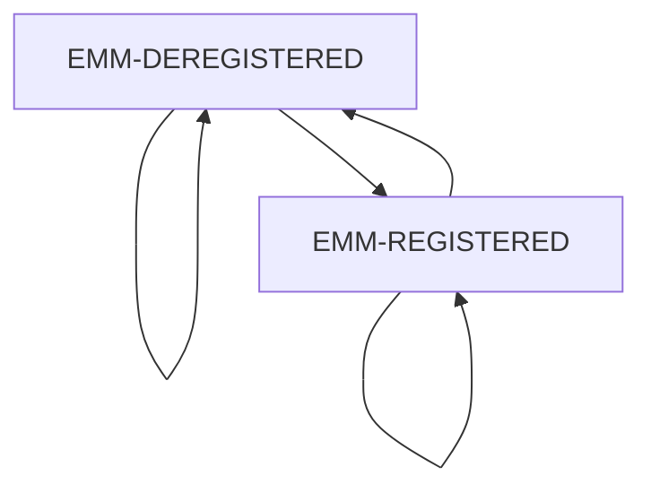

# 3GPP Protocol State Diagram

```mermaid
graph TD
    EMM-DEREGISTERED[EMM-DEREGISTERED] --> EMM-DEREGISTERED[EMM-DEREGISTERED]
    EMM-REGISTERED[EMM-REGISTERED] --> EMM-DEREGISTERED[EMM-DEREGISTERED]
    EMM-REGISTERED[EMM-REGISTERED] --> EMM-REGISTERED[EMM-REGISTERED]
    EMM-DEREGISTERED[EMM-DEREGISTERED] --> EMM-REGISTERED[EMM-REGISTERED]
```