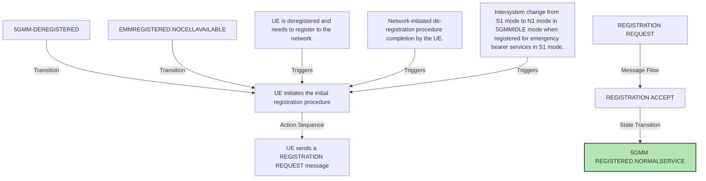

```mermaid
graph TD
    %% States
    A[5GMM-DEREGISTERED] -->|Transition| B[UE initiates the initial registration procedure]
    C[EMMREGISTERED.NOCELLAVAILABLE] -->|Transition| B
    D[5GMM REGISTERED.NORMALSERVICE]
    
    %% Triggers
    T1[UE is deregistered and needs to register to the network.] -->|Triggers| B
    T2[Network-initiated de-registration procedure completion by the UE.] -->|Triggers| B
    T3[Intersystem change from S1 mode to N1 mode in 5GMMIDLE mode when registered for emergency bearer services in S1 mode.] -->|Triggers| B
    
    %% Actions
    B -->|Action Sequence| E[UE sends a REGISTRATION REQUEST message]
    
    %% Messages
    M1[REGISTRATION REQUEST] -->|Message Flow| M2[REGISTRATION ACCEPT]
    M2 -->|State Transition| D

    %% Expected Outcomes
    class D outcome;
    classDef outcome fill:#b3e6b3,stroke:#333,stroke-width:2px;
```
