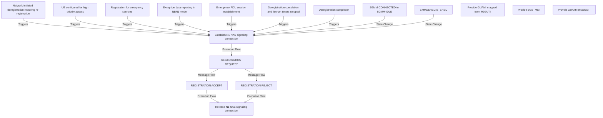

```mermaid
graph TD;
  %% Nodes
  trigger_1["Network-initiated deregistration requiring re-registration"]
  trigger_2["UE configured for high priority access"]
  trigger_3["Registration for emergency services"]
  trigger_4["Exception data reporting in NBN1 mode"]
  trigger_5["Emergency PDU session establishment"]
  trigger_6["Deregistration completion and Tsorcm timers stopped"]
  trigger_7["Deregistration completion"]

  state_1["5GMM-CONNECTED to 5GMM-IDLE"]
  state_2["EMMDEREGISTERED"]

  action_1["Provide GUAMI mapped from 4GGUTI"]
  action_2["Provide 5GSTMSI"]
  action_3["Provide GUAMI of 5GGUTI"]

  message_1["REGISTRATION REQUEST"]
  message_2["REGISTRATION ACCEPT"]
  message_3["REGISTRATION REJECT"]

  flow_1["Establish N1 NAS signaling connection"]
  flow_2["Release N1 NAS signaling connection"]

  %% Edges
  trigger_1 -->|Triggers| flow_1
  trigger_2 -->|Triggers| flow_1
  trigger_3 -->|Triggers| flow_1
  trigger_4 -->|Triggers| flow_1
  trigger_5 -->|Triggers| flow_1
  trigger_6 -->|Triggers| flow_1
  trigger_7 -->|Triggers| flow_1

  state_1 -->|State Change| flow_1
  state_2 -->|State Change| flow_1

  flow_1 -->|Execution Flow| message_1
  message_1 -->|Message Flow| message_2
  message_1 -->|Message Flow| message_3
  message_2 -->|Execution Flow| flow_2
  message_3 -->|Execution Flow| flow_2
```
