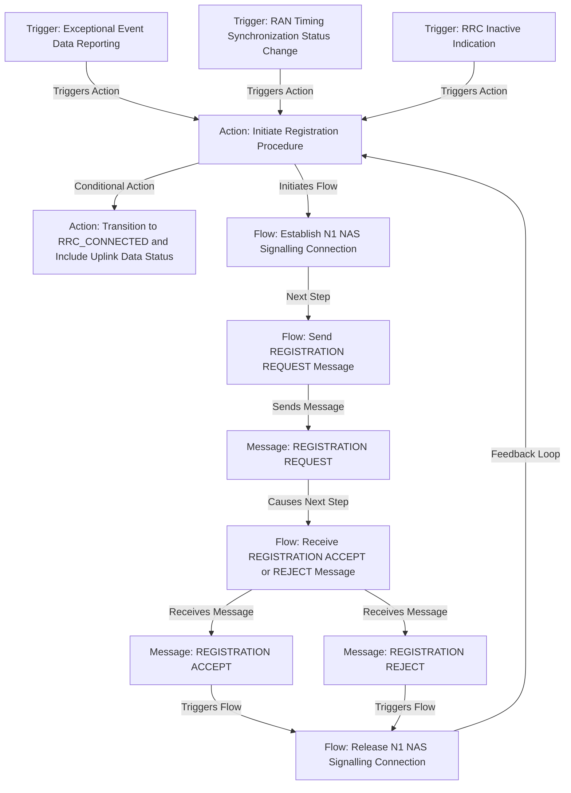

```mermaid
graph TD;
  %% Triggers
  Trigger1["Trigger: Exceptional Event Data Reporting"]
  Trigger2["Trigger: RAN Timing Synchronization Status Change"]
  Trigger3["Trigger: RRC Inactive Indication"]

  %% Actions
  Action1["Action: Initiate Registration Procedure"]
  Action2["Action: Transition to RRC_CONNECTED and Include Uplink Data Status"]

  %% Flows
  Flow1["Flow: Establish N1 NAS Signalling Connection"]
  Flow2["Flow: Send REGISTRATION REQUEST Message"]
  Flow3["Flow: Receive REGISTRATION ACCEPT or REJECT Message"]
  Flow4["Flow: Release N1 NAS Signalling Connection"]

  %% Messages
  Message1["Message: REGISTRATION REQUEST"]
  Message2["Message: REGISTRATION ACCEPT"]
  Message3["Message: REGISTRATION REJECT"]

  %% Edges
  Trigger1 -->|Triggers Action| Action1
  Trigger2 -->|Triggers Action| Action1
  Trigger3 -->|Triggers Action| Action1

  Action1 -->|Conditional Action| Action2
  Action1 -->|Initiates Flow| Flow1
  Flow1 -->|Next Step| Flow2
  Flow2 -->|Sends Message| Message1
  Message1 -->|Causes Next Step| Flow3
  Flow3 -->|Receives Message| Message2
  Flow3 -->|Receives Message| Message3
  Message2 -->|Triggers Flow| Flow4
  Message3 -->|Triggers Flow| Flow4
  Flow4 -->|Feedback Loop| Action1
```
