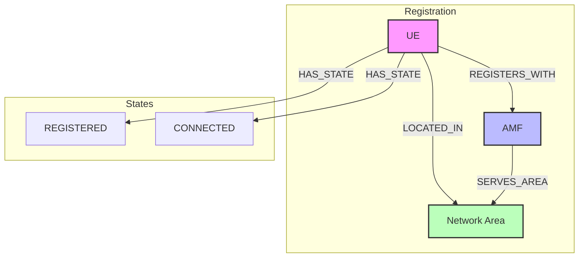
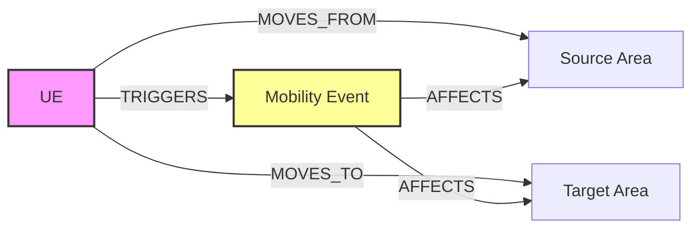

# Mobility Management Graph Visualizations

## 1. UE Registration and Location Flow


## 2. Mobility Event Tracking


## Neo4j Visualization Queries

### 1. Complete UE Mobility View
```cypher
// Shows UE's current registration, location, and active mobility events
MATCH (ue:UE)-[r1:REGISTERED_WITH]->(amf:AMF),
      (ue)-[r2:LOCATED_IN]->(area:NetworkArea),
      (amf)-[r3:SERVES_AREA]->(area),
      (ue)-[r4:INVOLVED_IN]->(event:MobilityEvent)
WHERE ue.id = $ue_id
RETURN *
```

### 2. Network Area Coverage Map
```cypher
// Visualizes AMF coverage areas and UEs in each area
MATCH (amf:AMF)-[r:SERVES_AREA]->(area:NetworkArea)
OPTIONAL MATCH (ue:UE)-[:LOCATED_IN]->(area)
RETURN amf, r, area,
       count(ue) as ue_count,
       collect(ue) as ues
```

### 3. UE Movement Timeline
```cypher
// Shows UE movement history with timestamps
MATCH (ue:UE)-[r:LOCATED_IN]->(area:NetworkArea)
WHERE ue.id = $ue_id
WITH ue, area, r
ORDER BY r.timestamp DESC
LIMIT 5
RETURN ue, r, area
```

### 4. Active Mobility Events
```cypher
// Shows all ongoing mobility events and affected UEs
MATCH (ue:UE)-[r:INVOLVED_IN]->(event:MobilityEvent)
WHERE event.status = 'ACTIVE'
RETURN ue, r, event
```

### 5. AMF Load Distribution
```cypher
// Visualizes AMF load across different areas
MATCH (amf:AMF)-[r:SERVES_AREA]->(area:NetworkArea)
WITH amf, count(area) as area_count,
     avg(toFloat(r.load_level)) as avg_load
RETURN amf, area_count, avg_load
ORDER BY avg_load DESC
```

## Custom Neo4j Graph Style

Add this to your Neo4j Browser to enhance visualization:
```cypher
:style
node.UE {
    color: #ff69b4;
    border-width: 2px;
    caption: '{id}';
}
node.AMF {
    color: #4169e1;
    border-width: 2px;
    caption: '{amf_id}';
}
node.NetworkArea {
    color: #98fb98;
    border-width: 2px;
    caption: '{area_code}';
}
node.MobilityEvent {
    color: #ffd700;
    border-width: 2px;
    caption: '{event_type}';
}
relationship.REGISTERED_WITH {
    color: #ff0000;
    width: 2px;
}
relationship.LOCATED_IN {
    color: #00ff00;
    width: 2px;
}
relationship.SERVES_AREA {
    color: #0000ff;
    width: 2px;
}
```

## Advanced Visualization Queries

### 1. UE Mobility Pattern Analysis
```cypher
// Analyzes UE movement patterns over time
MATCH (ue:UE)-[r:LOCATED_IN]->(area:NetworkArea)
WHERE ue.id = $ue_id
WITH ue, area, r.timestamp as timestamp
ORDER BY timestamp
WITH ue, collect({area: area.area_code, time: timestamp}) as movements
RETURN ue.id, movements
```

### 2. Network Load Heatmap
```cypher
// Creates a heatmap of network load across areas
MATCH (area:NetworkArea)<-[r:SERVES_AREA]-(amf:AMF)
WITH area, 
     avg(toFloat(r.load_level)) as load,
     count(distinct amf) as amf_count
RETURN area.area_code,
       load,
       amf_count
ORDER BY load DESC
```

### 3. Registration Flow Visualization
```cypher
// Visualizes the complete registration flow
MATCH path = (ue:UE)-[:REGISTERED_WITH]->(amf:AMF)
             -[:SERVES_AREA]->(area:NetworkArea)
WHERE ue.id = $ue_id
RETURN path
```

### 4. Mobility Event Impact Analysis
```cypher
// Shows the impact of mobility events on network areas
MATCH (event:MobilityEvent)<-[:INVOLVED_IN]-(ue:UE)
      -[:LOCATED_IN]->(area:NetworkArea)
WHERE event.timestamp > datetime() - duration('P1D')
RETURN event.event_type,
       count(distinct ue) as affected_ues,
       collect(distinct area.area_code) as affected_areas
```

### 5. Connection State Transitions
```cypher
// Visualizes UE connection state changes
MATCH (ue:UE)-[r:HAS_CONNECTION]->(conn:Connection)
WHERE ue.id = $ue_id
WITH ue, conn
ORDER BY conn.timestamp
RETURN ue.id,
       collect({state: conn.state, time: conn.timestamp}) as state_changes
``` 