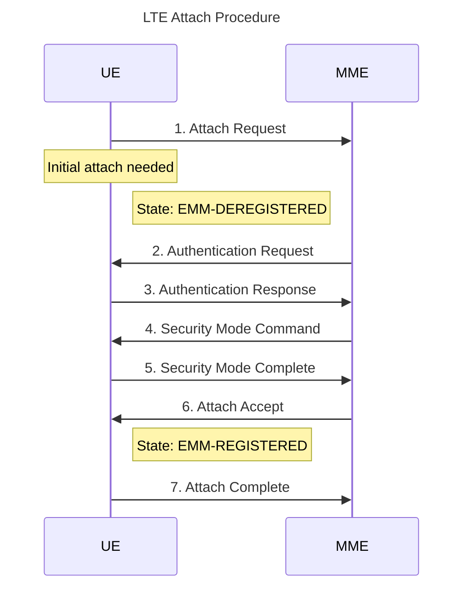
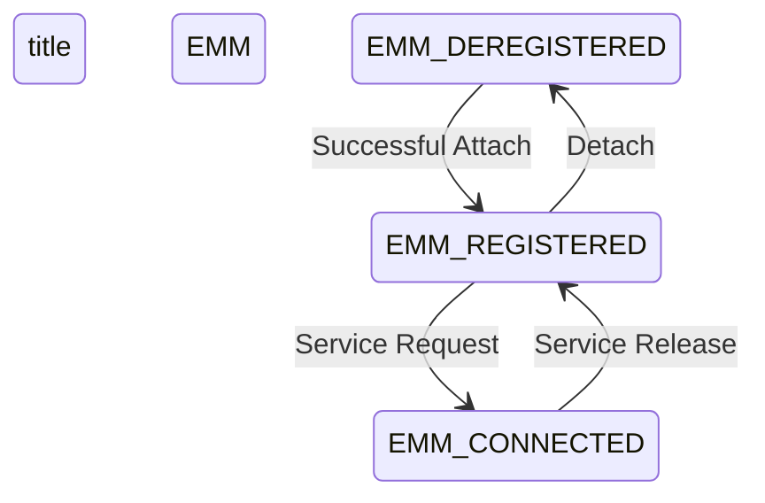

# Neo4j Queries for 3GPP NAS Components

## Basic Entity Queries

### Get All Procedures
```cypher
MATCH (p:Entity {type: 'PROCEDURE'})
RETURN p.name, p.description, p.specification, p.section
ORDER BY p.name;
```

### Get All States
```cypher
MATCH (s:Entity {type: 'STATE'})
RETURN s.name, s.description
ORDER BY s.name;
```

### Get All Messages
```cypher
MATCH (m:Entity {type: 'MESSAGE'})
RETURN m.name, m.description
ORDER BY m.name;
```

## Procedure Flow Queries

### Get Complete Procedure Flow with Steps
```cypher
MATCH (p:Procedure)-[:HAS_STEP]->(s:Step)
WHERE p.name = 'LTE Attach Procedure'  // Or any other procedure name
WITH p.name as procedure_name, s
ORDER BY s.sequence_number
RETURN procedure_name, collect({
    step_number: s.sequence_number,
    message: s.message,
    description: s.description
}) as steps;
```

### Get State Transitions in a Procedure
```cypher
MATCH (p:Procedure)-[:STARTS_FROM]->(initial:State),
      (p)-[:ENDS_IN]->(final:State),
      path = (initial)-[:TRANSITIONS_TO*]->(final)
WHERE p.name = 'Registration Procedure'  // Or any other procedure name
RETURN p.name, nodes(path) as state_sequence;
```

## Parameter and Condition Queries

### Get Steps with Parameters
```cypher
MATCH (s:Step)-[:HAS_PARAMETER]->(p:Parameter)
RETURN s.message, collect({
    parameter: p.name,
    description: p.description,
    mandatory: p.mandatory
}) as parameters;
```

### Get Steps with Conditions
```cypher
MATCH (s:Step)-[:HAS_CONDITION]->(c:Conditional)
RETURN s.message, collect({
    condition: c.condition,
    context: c.context
}) as conditions;
```

## Relationship Queries

### Get Message Sequences
```cypher
MATCH path = (m1:Entity {type: 'MESSAGE'})-[:FOLLOWED_BY*]->(m2:Entity {type: 'MESSAGE'})
RETURN [node in nodes(path) | node.name] as message_sequence;
```

### Get Network Element Interactions
```cypher
MATCH (n1:Entity {type: 'NETWORK_ELEMENT'})-[r]->(n2:Entity {type: 'NETWORK_ELEMENT'})
RETURN n1.name, type(r), n2.name;
```

## Complex Queries

### Get Complete Procedure Analysis
```cypher
MATCH (p:Procedure {name: 'Initial Registration Procedure'})  // Or any procedure
OPTIONAL MATCH (p)-[:HAS_STEP]->(s:Step)
OPTIONAL MATCH (s)-[:HAS_PARAMETER]->(param:Parameter)
OPTIONAL MATCH (s)-[:HAS_CONDITION]->(cond:Conditional)
RETURN p.name as procedure,
       p.description as description,
       collect(DISTINCT {
           step: s.message,
           sequence: s.sequence_number,
           parameters: collect(DISTINCT param.name),
           conditions: collect(DISTINCT cond.condition)
       }) as steps
ORDER BY s.sequence_number;
```

### Find Related Procedures
```cypher
MATCH (p1:Procedure)-[r*1..2]-(p2:Procedure)
WHERE p1.name <> p2.name
RETURN p1.name as procedure1,
       p2.name as procedure2,
       [rel in r | type(rel)] as relationship_types;
```

## Metadata Queries

### Get Specification References
```cypher
MATCH (e:Entity)
WHERE e.specification IS NOT NULL
RETURN e.type, e.name, e.specification, e.section
ORDER BY e.type;
```

### Get Release Information
```cypher
MATCH (e:Entity)
WHERE e.release IS NOT NULL
RETURN e.type, e.name, e.release
ORDER BY e.release;
```

## Diagnostic Queries

### Check Available Procedures
```cypher
// Show all procedures in the database
MATCH (p:Procedure)
RETURN p.name, p.type, p.description;
```

### Check All Entity Types
```cypher
// Show all types of entities and their counts
MATCH (n)
RETURN DISTINCT labels(n) as NodeType, count(*) as Count
ORDER BY Count DESC;
```

### Check All Relationships
```cypher
// Show all relationship types and their counts
MATCH ()-[r]->()
RETURN DISTINCT type(r) as RelationType, count(*) as Count
ORDER BY Count DESC;
```

### Check All Steps
```cypher
// Show all steps in the database
MATCH (s:Step)
RETURN s.message, s.sequence_number, s.description
ORDER BY s.sequence_number;
```

### Check All States
```cypher
// Show all states in the database
MATCH (s:State)
RETURN s.name, s.description;
```

### Check Entity Label Structure
```cypher
// Show how entities are labeled
MATCH (n:Entity)
RETURN n.type, collect(n.name) as Names
ORDER BY n.type;
```

## Mermaid Diagram Queries

### Generate Mermaid Sequence Diagram
```cypher
// This query generates Mermaid sequence diagram code for a procedure
MATCH (p:Procedure {name: 'LTE Attach Procedure'})
MATCH (p)-[:HAS_STEP]->(step:Step)
OPTIONAL MATCH (src:Entity {type: 'NETWORK_ELEMENT'})-[r:SENDS]->(msg:Entity {type: 'MESSAGE'})
WHERE msg.name IN step.message
OPTIONAL MATCH (step)-[:TRANSITIONS_TO]->(state:Entity {type: 'STATE'})
WITH step, src.name as source, msg.name as message, 
     step.description as description, state.name as state
ORDER BY step.sequence_number
WITH collect({
    step_number: step.sequence_number,
    source: source,
    message: message,
    description: description,
    state: state
}) as steps
RETURN 
'sequenceDiagram
    title LTE Attach Procedure
' + 
REDUCE(output = '', step IN steps |
    output + 
    CASE 
        WHEN step.source IS NOT NULL AND step.message IS NOT NULL
        THEN '    ' + step.source + '->>' + 
             CASE WHEN step.source = steps[0].source 
                  THEN 'Other' 
                  ELSE steps[0].source 
             END + 
             ': ' + step.step_number + '. ' + step.message + '\n' +
             CASE WHEN step.description IS NOT NULL 
                  THEN '    Note over ' + step.source + ': ' + step.description + '\n'
                  ELSE ''
             END +
             CASE WHEN step.state IS NOT NULL
                  THEN '    Note right of ' + step.source + ': State: ' + step.state + '\n'
                  ELSE ''
             END
        ELSE ''
    END
) as mermaid_code;
```

### Generate Mermaid State Diagram
```cypher
// This query generates Mermaid state diagram code
MATCH (s1:Entity)-[r:TRANSITIONS_TO]->(s2:Entity)
WHERE s1.type = 'STATE' AND s2.type = 'STATE'
WITH s1, s2, r
ORDER BY s1.name, s2.name
WITH collect({
    from_state: s1.name,
    to_state: s2.name,
    trigger: r.trigger
}) as transitions
RETURN 
'stateDiagram-v2
    title EMM State Transitions
' +
REDUCE(output = '', t IN transitions |
    output + '    ' + 
    REPLACE(t.from_state, '-', '_') + ' --> ' + 
    REPLACE(t.to_state, '-', '_') + 
    CASE WHEN t.trigger IS NOT NULL
         THEN ': ' + t.trigger
         ELSE ''
    END + '\n'
) as mermaid_code;
```

To use these queries:
1. Run the query in Neo4j Browser
2. Copy the returned mermaid_code string
3. Use a Mermaid editor (like Mermaid Live Editor) to visualize:
   - Remove any extra quotes
   - Paste the code
   - View the diagram

Example Mermaid output for sequence diagram:


Example Mermaid output for state diagram:
