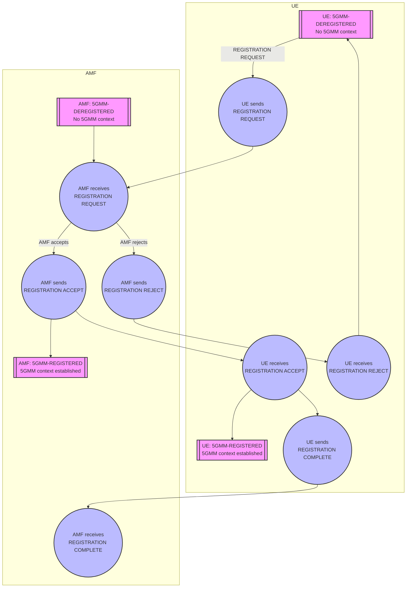

```mermaid
graph TD
    %% Define styles
    classDef state fill:#f9f,stroke:#333,stroke-width:2px;
    classDef event fill:#bbf,stroke:#333,stroke-width:2px;

    %% UE Lane (left side)
    UE_Dereg[[UE: 5GMM-DEREGISTERED<br>No 5GMM context]]:::state
    UE_Send_RegReq((UE sends<br>REGISTRATION REQUEST)):::event
    UE_Recv_Accept((UE receives<br>REGISTRATION ACCEPT)):::event
    UE_Reg[[UE: 5GMM-REGISTERED<br>5GMM context established]]:::state
    UE_Send_Comp((UE sends<br>REGISTRATION COMPLETE)):::event
    UE_Recv_Rej((UE receives<br>REGISTRATION REJECT)):::event

    %% AMF Lane (right side)
    AMF_Dereg[[AMF: 5GMM-DEREGISTERED<br>No 5GMM context]]:::state
    AMF_Recv_RegReq((AMF receives<br>REGISTRATION REQUEST)):::event
    AMF_Send_Accept((AMF sends<br>REGISTRATION ACCEPT)):::event
    AMF_Reg[[AMF: 5GMM-REGISTERED<br>5GMM context established]]:::state
    AMF_Recv_Comp((AMF receives<br>REGISTRATION COMPLETE)):::event
    AMF_Send_Rej((AMF sends<br>REGISTRATION REJECT)):::event

    %% Edges with labels
    UE_Dereg -->|REGISTRATION REQUEST| UE_Send_RegReq
    UE_Send_RegReq --> AMF_Recv_RegReq
    AMF_Dereg --> AMF_Recv_RegReq
    AMF_Recv_RegReq -->|AMF accepts| AMF_Send_Accept
    AMF_Recv_RegReq -->|AMF rejects| AMF_Send_Rej
    AMF_Send_Accept --> UE_Recv_Accept
    UE_Recv_Accept --> UE_Reg
    AMF_Send_Accept --> AMF_Reg
    UE_Recv_Accept --> UE_Send_Comp
    UE_Send_Comp --> AMF_Recv_Comp
    AMF_Send_Rej --> UE_Recv_Rej
    UE_Recv_Rej --> UE_Dereg

    %% Subgraph for visual separation (optional)
    subgraph UE
        UE_Dereg
        UE_Send_RegReq
        UE_Recv_Accept
        UE_Reg
        UE_Send_Comp
        UE_Recv_Rej

    end

    subgraph AMF
        AMF_Dereg
        AMF_Recv_RegReq
        AMF_Send_Accept
        AMF_Reg
        AMF_Recv_Comp
        AMF_Send_Rej
    end
```
