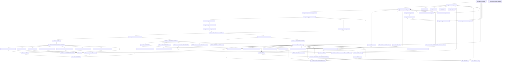

```mermaid
graph TD;
  UE_5GMM_DEREGISTERED;
  UE_Initiates_InitialRegistration;
  UE_5GMM_REGISTERED_INITIATED;
  AMF_Idle;
  AMF_Receives_REGISTRATION_REQUEST;
  AMF_ProcessingRegistrationRequest;
  AMF_Initiates_CommonProcedures;
  AMF_PerformingCommonProcedures;
  AMF_CommonProcedures_Complete;
  AMF_ReadyToSendRegistrationAcceptOrReject;
  AMF_Sends_REGISTRATION_ACCEPT;
  AMF_5GMM_COMMON_PROCEDURE_INITIATED;
  AMF_5GMM_REGISTERED;
  UE_Receives_REGISTRATION_ACCEPT;
  UE_5GMM_REGISTERED;
  UE_Sends_REGISTRATION_COMPLETE;
  AMF_Receives_REGISTRATION_COMPLETE;
  AMF_Sends_REGISTRATION_REJECT;
  UE_Receives_REGISTRATION_REJECT;
  UE_Handles_Rejection_Cause;
  UE_5GMM_DEREGISTERED_ATTEMPTING_REGISTRATION;
  UE_5GMM_DEREGISTERED_LIMITED_SERVICE;
  UE_5GMM_DEREGISTERED_PLMN_SEARCH;
  UE_5GMM_DEREGISTERED_NO_SUPI;
  UE_5GMM_DEREGISTERED_NO_CELL_AVAILABLE;
  Timer_T3510_Expired;
  Timer_T3511_Expired;
  Timer_T3346_Expired;
  Timer_T3550_Expired;
  LowerLayer_Failure_UE;
  LowerLayer_Failure_AMF;
  TAI_Change_Detected;
  UE_Initiates_MobilityRegistrationUpdate;
  UE_Initiates_DeRegistration;
  AMF_Receives_DEREGISTRATION_REQUEST;
  AMF_Retransmits_REGISTRATION_ACCEPT;
  AMF_Aborts_Registration_Procedure;
  UE_5GMM_REGISTERED_LIMITED_SERVICE_CAG;
  UE_5GMM_REGISTERED_PLMN_SEARCH_CAG;
  UE_LocallyReleases_NASConnection;
  No_Common_Procedures_Needed;
  Condition_For_REG_COMPLETE_Met;
  UE_Starts_T3510;
  UE_Increments_RegistrationAttemptCounter;
  UE_Starts_T3511;
  AMF_Starts_T3550;
  AMF_Stops_T3550;
  UE_Starts_T3346;
  TAI_Change_Detected_Before_REG_COMPLETE;
  UE_Stops_T3502;
  UE_Stops_T3511;
  UE_Starts_T3519;
  UE_Resets_RegistrationAttemptCounter_On_Accept;
  UE_Resets_PLMN_Counters_On_Accept;
  UE_Starts_T3502_Action;
  Condition_REG_COMPLETE_Not_Needed;
  UE_Performs_Local_DeRegistration;
  Transmission_Failure_REG_COMPLETE_and_TAI_Change_NotInList;
  Transmission_Failure_REG_REQUEST;
  AMF_Receives_New_REGISTRATION_REQUEST;
  AMF_Receives_MobilityOrPeriodicUpdateRequest;
  Timer_T3502_Expired;
  UE_Receives_DEREGISTRATION_REQUEST;
  AMF_Receives_New_REGISTRATION_REQUEST_Same_IEs;
  UE_Aborts_And_Reinitiates_Registration_Due_To_TAI_Change;
  UE_Handling_DeRegistration;
  UE_Sends_DEREGISTRATION_REQUEST;
  Transmission_Failure_REG_COMPLETE_and_TAI_Change_InList;
  UE_5GMM_DEREGISTERED --> UE_Initiates_InitialRegistration;
  UE_Initiates_InitialRegistration --> UE_5GMM_REGISTERED_INITIATED;
  UE_5GMM_REGISTERED_INITIATED --> AMF_Receives_REGISTRATION_REQUEST;
  AMF_Receives_REGISTRATION_REQUEST --> AMF_ProcessingRegistrationRequest;
  AMF_ProcessingRegistrationRequest --> AMF_Initiates_CommonProcedures;
  AMF_Initiates_CommonProcedures --> AMF_PerformingCommonProcedures;
  AMF_PerformingCommonProcedures --> AMF_CommonProcedures_Complete;
  AMF_CommonProcedures_Complete --> AMF_ReadyToSendRegistrationAcceptOrReject;
  AMF_ReadyToSendRegistrationAcceptOrReject --> AMF_Sends_REGISTRATION_ACCEPT;
  UE_Receives_REGISTRATION_ACCEPT --> UE_5GMM_REGISTERED;
  AMF_5GMM_COMMON_PROCEDURE_INITIATED --> AMF_Receives_REGISTRATION_COMPLETE;
  AMF_ReadyToSendRegistrationAcceptOrReject --> AMF_Sends_REGISTRATION_REJECT;
  AMF_Sends_REGISTRATION_REJECT --> AMF_Idle;
  UE_Receives_REGISTRATION_REJECT --> UE_Handles_Rejection_Cause;
  UE_Handles_Rejection_Cause --> UE_5GMM_DEREGISTERED_LIMITED_SERVICE;
  UE_Handles_Rejection_Cause --> UE_5GMM_DEREGISTERED_PLMN_SEARCH;
  UE_Handles_Rejection_Cause --> UE_5GMM_DEREGISTERED_NO_SUPI;
  UE_Handles_Rejection_Cause --> UE_5GMM_DEREGISTERED_NO_CELL_AVAILABLE;
  UE_5GMM_REGISTERED_INITIATED --> Timer_T3510_Expired;
  UE_5GMM_DEREGISTERED_ATTEMPTING_REGISTRATION --> Timer_T3511_Expired;
  Timer_T3511_Expired --> UE_Initiates_InitialRegistration;
  UE_5GMM_DEREGISTERED_ATTEMPTING_REGISTRATION --> Timer_T3346_Expired;
  Timer_T3346_Expired --> UE_Initiates_InitialRegistration;
  AMF_5GMM_COMMON_PROCEDURE_INITIATED --> Timer_T3550_Expired;
  Timer_T3550_Expired --> AMF_Retransmits_REGISTRATION_ACCEPT;
  AMF_Retransmits_REGISTRATION_ACCEPT --> AMF_5GMM_COMMON_PROCEDURE_INITIATED;
  Timer_T3550_Expired --> AMF_Aborts_Registration_Procedure;
  UE_5GMM_REGISTERED_INITIATED --> LowerLayer_Failure_UE;
  AMF_5GMM_COMMON_PROCEDURE_INITIATED --> LowerLayer_Failure_AMF;
  LowerLayer_Failure_AMF --> AMF_Aborts_Registration_Procedure;
  UE_5GMM_REGISTERED_INITIATED --> TAI_Change_Detected;
  UE_5GMM_REGISTERED --> TAI_Change_Detected;
  TAI_Change_Detected --> UE_Initiates_MobilityRegistrationUpdate;
  UE_5GMM_REGISTERED_INITIATED --> UE_Initiates_DeRegistration;
  AMF_5GMM_COMMON_PROCEDURE_INITIATED --> AMF_Receives_DEREGISTRATION_REQUEST;
  AMF_Receives_DEREGISTRATION_REQUEST --> AMF_Idle;
  UE_Receives_REGISTRATION_ACCEPT --> UE_LocallyReleases_NASConnection;
  AMF_ProcessingRegistrationRequest --> No_Common_Procedures_Needed;
  No_Common_Procedures_Needed --> AMF_ReadyToSendRegistrationAcceptOrReject;
  UE_Receives_REGISTRATION_ACCEPT --> Condition_For_REG_COMPLETE_Met;
  Condition_For_REG_COMPLETE_Met --> UE_Sends_REGISTRATION_COMPLETE;
  UE_Initiates_InitialRegistration --> UE_Starts_T3510;
  Timer_T3510_Expired --> UE_Increments_RegistrationAttemptCounter;
  UE_Handles_Rejection_Cause --> UE_Increments_RegistrationAttemptCounter;
  LowerLayer_Failure_UE --> UE_Increments_RegistrationAttemptCounter;
  UE_Increments_RegistrationAttemptCounter --> UE_Starts_T3511;
  UE_Starts_T3511 --> UE_5GMM_DEREGISTERED_ATTEMPTING_REGISTRATION;
  UE_Increments_RegistrationAttemptCounter --> UE_5GMM_DEREGISTERED_PLMN_SEARCH;
  AMF_Sends_REGISTRATION_ACCEPT --> AMF_Starts_T3550;
  AMF_Starts_T3550 --> AMF_5GMM_COMMON_PROCEDURE_INITIATED;
  AMF_Receives_REGISTRATION_COMPLETE --> AMF_Stops_T3550;
  AMF_Stops_T3550 --> AMF_5GMM_REGISTERED;
  UE_Handles_Rejection_Cause --> UE_Starts_T3346;
  UE_Receives_REGISTRATION_ACCEPT --> TAI_Change_Detected_Before_REG_COMPLETE;
  TAI_Change_Detected_Before_REG_COMPLETE --> UE_Initiates_MobilityRegistrationUpdate;
  UE_Initiates_InitialRegistration --> UE_Stops_T3502;
  UE_Initiates_InitialRegistration --> UE_Stops_T3511;
  UE_Initiates_InitialRegistration --> UE_Starts_T3519;
  UE_Receives_REGISTRATION_ACCEPT --> UE_Resets_RegistrationAttemptCounter_On_Accept;
  UE_Receives_REGISTRATION_ACCEPT --> UE_Resets_PLMN_Counters_On_Accept;
  UE_LocallyReleases_NASConnection --> UE_5GMM_DEREGISTERED;
  UE_Starts_T3346 --> UE_5GMM_DEREGISTERED_ATTEMPTING_REGISTRATION;
  UE_Increments_RegistrationAttemptCounter --> UE_Starts_T3502_Action;
  TAI_Change_Detected_Before_REG_COMPLETE --> UE_Sends_REGISTRATION_COMPLETE;
  AMF_Sends_REGISTRATION_ACCEPT --> AMF_5GMM_REGISTERED;
  UE_Performs_Local_DeRegistration --> UE_5GMM_DEREGISTERED;
  UE_5GMM_REGISTERED_INITIATED --> Transmission_Failure_REG_COMPLETE_and_TAI_Change_NotInList;
  Transmission_Failure_REG_COMPLETE_and_TAI_Change_NotInList --> UE_Initiates_MobilityRegistrationUpdate;
  UE_5GMM_REGISTERED_INITIATED --> Transmission_Failure_REG_REQUEST;
  Transmission_Failure_REG_REQUEST --> UE_Initiates_InitialRegistration;
  AMF_5GMM_COMMON_PROCEDURE_INITIATED --> AMF_Receives_New_REGISTRATION_REQUEST;
  AMF_Receives_New_REGISTRATION_REQUEST --> AMF_Aborts_Registration_Procedure;
  AMF_5GMM_COMMON_PROCEDURE_INITIATED --> AMF_Receives_MobilityOrPeriodicUpdateRequest;
  AMF_Receives_MobilityOrPeriodicUpdateRequest --> AMF_Stops_T3550;
  UE_Handles_Rejection_Cause --> UE_5GMM_DEREGISTERED_NO_CELL_AVAILABLE;
  UE_Handles_Rejection_Cause --> UE_5GMM_DEREGISTERED_PLMN_SEARCH;
  UE_Handles_Rejection_Cause --> UE_5GMM_DEREGISTERED_LIMITED_SERVICE;
  UE_Handles_Rejection_Cause --> UE_5GMM_DEREGISTERED_LIMITED_SERVICE;
  UE_Handles_Rejection_Cause --> UE_5GMM_DEREGISTERED_PLMN_SEARCH;
  UE_Handles_Rejection_Cause --> UE_5GMM_DEREGISTERED_LIMITED_SERVICE;
  UE_Handles_Rejection_Cause --> UE_5GMM_DEREGISTERED_LIMITED_SERVICE;
  UE_Handles_Rejection_Cause --> UE_5GMM_DEREGISTERED_ATTEMPTING_REGISTRATION;
  UE_Handles_Rejection_Cause --> UE_5GMM_DEREGISTERED_PLMN_SEARCH;
  UE_Handles_Rejection_Cause --> UE_5GMM_DEREGISTERED_LIMITED_SERVICE;
  UE_Handles_Rejection_Cause --> UE_5GMM_DEREGISTERED_PLMN_SEARCH;
  UE_5GMM_REGISTERED_INITIATED --> UE_Receives_DEREGISTRATION_REQUEST;
  UE_Receives_DEREGISTRATION_REQUEST --> UE_5GMM_REGISTERED_INITIATED;
  AMF_Aborts_Registration_Procedure --> AMF_ProcessingRegistrationRequest;
  AMF_5GMM_COMMON_PROCEDURE_INITIATED --> AMF_Receives_New_REGISTRATION_REQUEST_Same_IEs;
  AMF_Receives_New_REGISTRATION_REQUEST_Same_IEs --> AMF_Retransmits_REGISTRATION_ACCEPT;
  TAI_Change_Detected --> UE_Aborts_And_Reinitiates_Registration_Due_To_TAI_Change;
  UE_Aborts_And_Reinitiates_Registration_Due_To_TAI_Change --> UE_Initiates_InitialRegistration;
  UE_Initiates_DeRegistration --> UE_Handling_DeRegistration;
  UE_Handling_DeRegistration --> UE_Performs_Local_DeRegistration;
  UE_Handling_DeRegistration --> UE_Sends_DEREGISTRATION_REQUEST;
  UE_Sends_DEREGISTRATION_REQUEST --> UE_5GMM_DEREGISTERED;
  UE_Starts_T3502_Action --> Timer_T3502_Expired;
  Timer_T3502_Expired --> UE_5GMM_DEREGISTERED_PLMN_SEARCH;
  AMF_Sends_REGISTRATION_ACCEPT --> UE_Receives_REGISTRATION_ACCEPT;
  AMF_Sends_REGISTRATION_REJECT --> UE_Receives_REGISTRATION_REJECT;
  UE_5GMM_REGISTERED --> UE_5GMM_REGISTERED_LIMITED_SERVICE_CAG;
  UE_5GMM_REGISTERED --> UE_5GMM_REGISTERED_PLMN_SEARCH_CAG;
  UE_5GMM_REGISTERED_INITIATED --> Transmission_Failure_REG_COMPLETE_and_TAI_Change_InList;
  Transmission_Failure_REG_COMPLETE_and_TAI_Change_InList --> UE_Sends_REGISTRATION_COMPLETE;
  AMF_Aborts_Registration_Procedure --> AMF_5GMM_REGISTERED;
```
