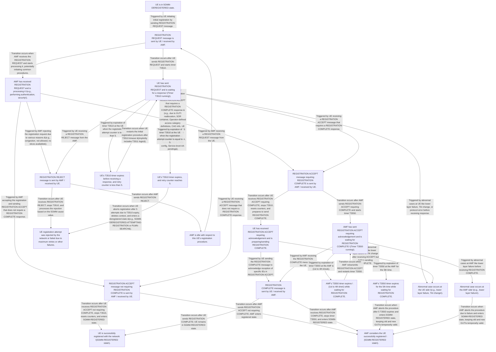

```mermaid
graph TD;
  UE_Deregistered["UE is in 5GMM-DEREGISTERED state."];
  UE_Attempting_Initial_Registration["UE has sent REGISTRATION REQUEST and is waiting for a response \(Timer T3510 running\)."];
  UE_Sending_RegComplete["UE has received REGISTRATION ACCEPT requiring acknowledgement and is preparing/sending REGISTRATION COMPLETE."];
  UE_Registered["UE is successfully registered with the network \(5GMM-REGISTERED state\)."];
  UE_Registration_Rejected["UE registration attempt was rejected by the network or failed due to maximum retries or other failures."];
  AMF_Idle["AMF is idle with respect to this UE's registration procedure."];
  AMF_Processing_Initial_Registration["AMF has received REGISTRATION REQUEST and is processing it \(e.g., performing authentication, security\)."];
  AMF_Waiting_Registration_Complete["AMF has sent REGISTRATION ACCEPT requiring acknowledgement and is waiting for REGISTRATION COMPLETE \(Timer T3550 running\)."];
  AMF_Registered["AMF considers the UE successfully registered \(5GMM-REGISTERED state\)."];
  E_REGISTRATION_REQUEST["REGISTRATION REQUEST message is sent by UE / received by AMF."];
  E_REGISTRATION_ACCEPT_ReqComplete["REGISTRATION ACCEPT message requiring REGISTRATION COMPLETE is sent by AMF / received by UE."];
  E_REGISTRATION_ACCEPT_NoComplete["REGISTRATION ACCEPT message not requiring REGISTRATION COMPLETE is sent by AMF / received by UE."];
  E_REGISTRATION_REJECT["REGISTRATION REJECT message is sent by AMF / received by UE."];
  E_REGISTRATION_COMPLETE["REGISTRATION COMPLETE message is sent by UE / received by AMF."];
  E_T3510_Timeout_Retry["UE's T3510 timer expires before receiving a response, and retry counter is less than 5."];
  E_T3510_Timeout_Max["UE's T3510 timer expires, and retry counter reaches 5."];
  E_T3550_Timeout_Retry["AMF's T3550 timer expires \(1st to 4th time\) while waiting for REGISTRATION COMPLETE."];
  E_T3550_Timeout_Max["AMF's T3550 timer expires for the 5th time while waiting for REGISTRATION COMPLETE."];
  E_Failure_UE["Abnormal case occurs at the UE side \(e.g., lower layer failure, TAI change\)."];
  E_Failure_AMF["Abnormal case occurs at the AMF side \(e.g., lower layer failure\)."];
  UE_Deregistered -->|Triggered by UE initiating initial registration by sending REGISTRATION REQUEST message.| E_REGISTRATION_REQUEST;
  E_REGISTRATION_REQUEST -->|Transition occurs after UE sends REGISTRATION REQUEST and starts timer T3510.| UE_Attempting_Initial_Registration;
  AMF_Idle -->|Triggered by AMF receiving a REGISTRATION REQUEST message from the UE.| E_REGISTRATION_REQUEST;
  E_REGISTRATION_REQUEST -->|Transition occurs when AMF receives the REGISTRATION REQUEST and starts processing it, potentially initiating common procedures.| AMF_Processing_Initial_Registration;
  AMF_Processing_Initial_Registration -->|Triggered by AMF accepting the registration and sending REGISTRATION ACCEPT that requires a REGISTRATION COMPLETE response &#40;e.g., due to GUTI reallocation, SOR container, Operator-defined access category definitions, CAG info, UE radio capability ID, PEIPS info, NSAG info, NSSAI update, On-demand NSSAI, Alternative NSSAI, Truncated 5G-S-TMSI config, Service-level-AA pending&#41;.| E_REGISTRATION_ACCEPT_ReqComplete;
  E_REGISTRATION_ACCEPT_ReqComplete -->|Transition occurs after AMF sends REGISTRATION ACCEPT requiring COMPLETE and starts timer T3550.| AMF_Waiting_Registration_Complete;
  AMF_Processing_Initial_Registration -->|Triggered by AMF accepting the registration and sending REGISTRATION ACCEPT that does not require a REGISTRATION COMPLETE response.| E_REGISTRATION_ACCEPT_NoComplete;
  E_REGISTRATION_ACCEPT_NoComplete -->|Transition occurs after AMF sends REGISTRATION ACCEPT not requiring COMPLETE; AMF enters registered state.| AMF_Registered;
  AMF_Processing_Initial_Registration -->|Triggered by AMF rejecting the registration request due to various reasons &#40;e.g., congestion, not allowed, no slices available&#41;.| E_REGISTRATION_REJECT;
  E_REGISTRATION_REJECT -->|Transition occurs after AMF sends REGISTRATION REJECT.| AMF_Idle;
  UE_Attempting_Initial_Registration -->|Triggered by UE receiving a REGISTRATION ACCEPT message that requires a REGISTRATION COMPLETE response.| E_REGISTRATION_ACCEPT_ReqComplete;
  E_REGISTRATION_ACCEPT_ReqComplete -->|Transition occurs after UE receives REGISTRATION ACCEPT requiring COMPLETE, stops T3510, resets counters, and prepares to send REGISTRATION COMPLETE.| UE_Sending_RegComplete;
  UE_Attempting_Initial_Registration -->|Triggered by UE receiving a REGISTRATION ACCEPT message that does not require a REGISTRATION COMPLETE response.| E_REGISTRATION_ACCEPT_NoComplete;
  E_REGISTRATION_ACCEPT_NoComplete -->|Transition occurs after UE receives REGISTRATION ACCEPT not requiring COMPLETE, stops T3510, resets counters, and enters 5GMM-REGISTERED state.| UE_Registered;
  UE_Attempting_Initial_Registration -->|Triggered by UE receiving a REGISTRATION REJECT message from the AMF.| E_REGISTRATION_REJECT;
  E_REGISTRATION_REJECT -->|Transition occurs after UE receives REGISTRATION REJECT, stops T3510, and processes the rejection based on the 5GMM cause value.| UE_Registration_Rejected;
  UE_Sending_RegComplete -->|Triggered by UE sending the REGISTRATION COMPLETE message to acknowledge reception of specific IEs in REGISTRATION ACCEPT.| E_REGISTRATION_COMPLETE;
  E_REGISTRATION_COMPLETE -->|Transition occurs after UE sends REGISTRATION COMPLETE; UE remains in 5GMM-REGISTERED state.| UE_Registered;
  AMF_Waiting_Registration_Complete -->|Triggered by AMF receiving the REGISTRATION COMPLETE message from the UE.| E_REGISTRATION_COMPLETE;
  E_REGISTRATION_COMPLETE -->|Transition occurs after AMF receives REGISTRATION COMPLETE, stops timer T3550, and enters 5GMM-REGISTERED state.| AMF_Registered;
  UE_Attempting_Initial_Registration -->|Triggered by expiration of timer T3510 at the UE when the registration attempt counter is less than 5.| E_T3510_Timeout_Retry;
  E_T3510_Timeout_Retry -->|Transition occurs when UE restarts the initial registration procedure after T3510 timeout &#40;implicitly includes T3511 logic&#41;.| UE_Attempting_Initial_Registration;
  UE_Attempting_Initial_Registration -->|Triggered by expiration of timer T3510 at the UE when the registration attempt counter is equal to 5.| E_T3510_Timeout_Max;
  E_T3510_Timeout_Max -->|Transition occurs when UE aborts registration after 5 attempts due to T3510 expiry, deletes context, and enters a deregistered state &#40;e.g., 5GMM-DEREGISTERED.ATTEMPTING-REGISTRATION or PLMN-SEARCH&#41;.| UE_Registration_Rejected;
  UE_Attempting_Initial_Registration -->|Triggered by abnormal cases at UE like lower layer failure, TAI change, or protocol error before receiving response.| E_Failure_UE;
  UE_Sending_RegComplete -->|Triggered by abnormal cases at UE like lower layer failure or TAI change after receiving ACCEPT but before sending COMPLETE.| E_Failure_UE;
  AMF_Waiting_Registration_Complete -->|Triggered by expiration of timer T3550 at the AMF &#40;1st to 4th time&#41;.| E_T3550_Timeout_Retry;
  E_T3550_Timeout_Retry -->|Transition occurs when AMF retransmits REGISTRATION ACCEPT and restarts timer T3550.| AMF_Waiting_Registration_Complete;
  AMF_Waiting_Registration_Complete -->|Triggered by expiration of timer T3550 at the AMF for the 5th time.| E_T3550_Timeout_Max;
  E_T3550_Timeout_Max -->|Transition occurs when AMF aborts the procedure after 5 T3550 expiries and enters 5GMM-REGISTERED state, keeping old and new GUTIs temporarily valid.| AMF_Registered;
  AMF_Waiting_Registration_Complete -->|Triggered by abnormal cases at AMF like lower layer failure before receiving REGISTRATION COMPLETE.| E_Failure_AMF;
  E_Failure_AMF -->|Transition occurs when AMF aborts the procedure due to failure and enters 5GMM-REGISTERED state, keeping old and new GUTIs temporarily valid.| AMF_Registered;
```
