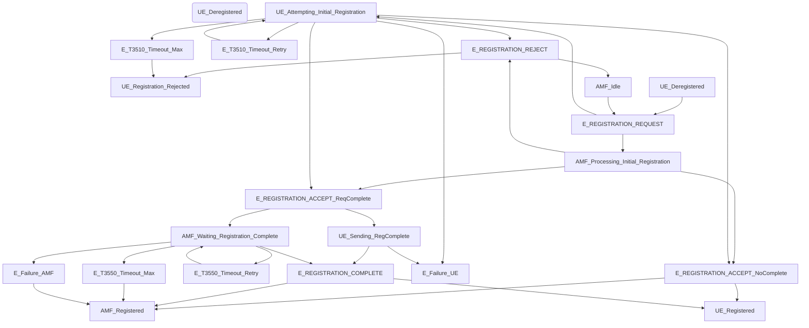

```mermaid
graph TD;
  %% Procedure: Registration procedure for initial registration
  A(UE_Deregistered);
  %% Type: state
  %% Description: UE is in 5GMM-DEREGISTERED state.
  UE_Attempting_Initial_Registration;
  %% Type: state
  %% Description: UE has sent REGISTRATION REQUEST and is waiting for a response (Timer T3510 running).
  UE_Sending_RegComplete;
  %% Type: state
  %% Description: UE has received REGISTRATION ACCEPT requiring acknowledgement and is preparing/sending REGISTRATION COMPLETE.
  UE_Registered;
  %% Type: state
  %% Description: UE is successfully registered with the network (5GMM-REGISTERED state).
  UE_Registration_Rejected;
  %% Type: state
  %% Description: UE registration attempt was rejected by the network or failed due to maximum retries or other failures.
  AMF_Idle;
  %% Type: state
  %% Description: AMF is idle with respect to this UE's registration procedure.
  AMF_Processing_Initial_Registration;
  %% Type: state
  %% Description: AMF has received REGISTRATION REQUEST and is processing it (e.g., performing authentication, security).
  AMF_Waiting_Registration_Complete;
  %% Type: state
  %% Description: AMF has sent REGISTRATION ACCEPT requiring acknowledgement and is waiting for REGISTRATION COMPLETE (Timer T3550 running).
  AMF_Registered;
  %% Type: state
  %% Description: AMF considers the UE successfully registered (5GMM-REGISTERED state).
  E_REGISTRATION_REQUEST;
  %% Type: event
  %% Description: REGISTRATION REQUEST message is sent by UE / received by AMF.
  E_REGISTRATION_ACCEPT_ReqComplete;
  %% Type: event
  %% Description: REGISTRATION ACCEPT message requiring REGISTRATION COMPLETE is sent by AMF / received by UE.
  E_REGISTRATION_ACCEPT_NoComplete;
  %% Type: event
  %% Description: REGISTRATION ACCEPT message not requiring REGISTRATION COMPLETE is sent by AMF / received by UE.
  E_REGISTRATION_REJECT;
  %% Type: event
  %% Description: REGISTRATION REJECT message is sent by AMF / received by UE.
  E_REGISTRATION_COMPLETE;
  %% Type: event
  %% Description: REGISTRATION COMPLETE message is sent by UE / received by AMF.
  E_T3510_Timeout_Retry;
  %% Type: event
  %% Description: UE's T3510 timer expires before receiving a response, and retry counter is less than 5.
  E_T3510_Timeout_Max;
  %% Type: event
  %% Description: UE's T3510 timer expires, and retry counter reaches 5.
  E_T3550_Timeout_Retry;
  %% Type: event
  %% Description: AMF's T3550 timer expires (1st to 4th time) while waiting for REGISTRATION COMPLETE.
  E_T3550_Timeout_Max;
  %% Type: event
  %% Description: AMF's T3550 timer expires for the 5th time while waiting for REGISTRATION COMPLETE.
  E_Failure_UE;
  %% Type: event
  %% Description: Abnormal case occurs at the UE side (e.g., lower layer failure, TAI change).
  E_Failure_AMF;
  %% Type: event
  %% Description: Abnormal case occurs at the AMF side (e.g., lower layer failure).
  UE_Deregistered -->E_REGISTRATION_REQUEST;
  %% Type: trigger
  %% Description: Triggered by UE initiating initial registration by sending REGISTRATION REQUEST message.
  E_REGISTRATION_REQUEST -->UE_Attempting_Initial_Registration;
  %% Type: condition
  %% Description: Transition occurs after UE sends REGISTRATION REQUEST and starts timer T3510.
  AMF_Idle -->E_REGISTRATION_REQUEST;
  %% Type: trigger
  %% Description: Triggered by AMF receiving a REGISTRATION REQUEST message from the UE.
  E_REGISTRATION_REQUEST -->AMF_Processing_Initial_Registration;
  %% Type: condition
  %% Description: Transition occurs when AMF receives the REGISTRATION REQUEST and starts processing it, potentially initiating common procedures.
  AMF_Processing_Initial_Registration -->E_REGISTRATION_ACCEPT_ReqComplete;
  %% Type: trigger
  %% Description: Triggered by AMF accepting the registration and sending REGISTRATION ACCEPT that requires a REGISTRATION COMPLETE response (e.g., due to GUTI reallocation, SOR container, Operator-defined access category definitions, CAG info, UE radio capability ID, PEIPS info, NSAG info, NSSAI update, On-demand NSSAI, Alternative NSSAI, Truncated 5G-S-TMSI config, Service-level-AA pending).
  E_REGISTRATION_ACCEPT_ReqComplete -->AMF_Waiting_Registration_Complete;
  %% Type: condition
  %% Description: Transition occurs after AMF sends REGISTRATION ACCEPT requiring COMPLETE and starts timer T3550.
  AMF_Processing_Initial_Registration -->E_REGISTRATION_ACCEPT_NoComplete;
  %% Type: trigger
  %% Description: Triggered by AMF accepting the registration and sending REGISTRATION ACCEPT that does not require a REGISTRATION COMPLETE response.
  E_REGISTRATION_ACCEPT_NoComplete -->AMF_Registered;
  %% Type: condition
  %% Description: Transition occurs after AMF sends REGISTRATION ACCEPT not requiring COMPLETE; AMF enters registered state.
  AMF_Processing_Initial_Registration -->E_REGISTRATION_REJECT;
  %% Type: trigger
  %% Description: Triggered by AMF rejecting the registration request due to various reasons (e.g., congestion, not allowed, no slices available).
  E_REGISTRATION_REJECT -->AMF_Idle;
  %% Type: condition
  %% Description: Transition occurs after AMF sends REGISTRATION REJECT.
  UE_Attempting_Initial_Registration -->E_REGISTRATION_ACCEPT_ReqComplete;
  %% Type: trigger
  %% Description: Triggered by UE receiving a REGISTRATION ACCEPT message that requires a REGISTRATION COMPLETE response.
  E_REGISTRATION_ACCEPT_ReqComplete -->UE_Sending_RegComplete;
  %% Type: condition
  %% Description: Transition occurs after UE receives REGISTRATION ACCEPT requiring COMPLETE, stops T3510, resets counters, and prepares to send REGISTRATION COMPLETE.
  UE_Attempting_Initial_Registration -->E_REGISTRATION_ACCEPT_NoComplete;
  %% Type: trigger
  %% Description: Triggered by UE receiving a REGISTRATION ACCEPT message that does not require a REGISTRATION COMPLETE response.
  E_REGISTRATION_ACCEPT_NoComplete -->UE_Registered;
  %% Type: condition
  %% Description: Transition occurs after UE receives REGISTRATION ACCEPT not requiring COMPLETE, stops T3510, resets counters, and enters 5GMM-REGISTERED state.
  UE_Attempting_Initial_Registration -->E_REGISTRATION_REJECT;
  %% Type: trigger
  %% Description: Triggered by UE receiving a REGISTRATION REJECT message from the AMF.
  E_REGISTRATION_REJECT -->UE_Registration_Rejected;
  %% Type: condition
  %% Description: Transition occurs after UE receives REGISTRATION REJECT, stops T3510, and processes the rejection based on the 5GMM cause value.
  UE_Sending_RegComplete -->E_REGISTRATION_COMPLETE;
  %% Type: trigger
  %% Description: Triggered by UE sending the REGISTRATION COMPLETE message to acknowledge reception of specific IEs in REGISTRATION ACCEPT.
  E_REGISTRATION_COMPLETE -->UE_Registered;
  %% Type: condition
  %% Description: Transition occurs after UE sends REGISTRATION COMPLETE; UE remains in 5GMM-REGISTERED state.
  AMF_Waiting_Registration_Complete -->E_REGISTRATION_COMPLETE;
  %% Type: trigger
  %% Description: Triggered by AMF receiving the REGISTRATION COMPLETE message from the UE.
  E_REGISTRATION_COMPLETE -->AMF_Registered;
  %% Type: condition
  %% Description: Transition occurs after AMF receives REGISTRATION COMPLETE, stops timer T3550, and enters 5GMM-REGISTERED state.
  UE_Attempting_Initial_Registration -->E_T3510_Timeout_Retry;
  %% Type: trigger
  %% Description: Triggered by expiration of timer T3510 at the UE when the registration attempt counter is less than 5.
  E_T3510_Timeout_Retry -->UE_Attempting_Initial_Registration;
  %% Type: condition
  %% Description: Transition occurs when UE restarts the initial registration procedure after T3510 timeout (implicitly includes T3511 logic).
  UE_Attempting_Initial_Registration -->E_T3510_Timeout_Max;
  %% Type: trigger
  %% Description: Triggered by expiration of timer T3510 at the UE when the registration attempt counter is equal to 5.
  E_T3510_Timeout_Max -->UE_Registration_Rejected;
  %% Type: condition
  %% Description: Transition occurs when UE aborts registration after 5 attempts due to T3510 expiry, deletes context, and enters a deregistered state (e.g., 5GMM-DEREGISTERED.ATTEMPTING-REGISTRATION or PLMN-SEARCH).
  UE_Attempting_Initial_Registration -->E_Failure_UE;
  %% Type: trigger
  %% Description: Triggered by abnormal cases at UE like lower layer failure, TAI change, or protocol error before receiving response.
  UE_Sending_RegComplete -->E_Failure_UE;
  %% Type: trigger
  %% Description: Triggered by abnormal cases at UE like lower layer failure or TAI change after receiving ACCEPT but before sending COMPLETE.
  AMF_Waiting_Registration_Complete -->E_T3550_Timeout_Retry;
  %% Type: trigger
  %% Description: Triggered by expiration of timer T3550 at the AMF (1st to 4th time).
  E_T3550_Timeout_Retry -->AMF_Waiting_Registration_Complete;
  %% Type: condition
  %% Description: Transition occurs when AMF retransmits REGISTRATION ACCEPT and restarts timer T3550.
  AMF_Waiting_Registration_Complete -->E_T3550_Timeout_Max;
  %% Type: trigger
  %% Description: Triggered by expiration of timer T3550 at the AMF for the 5th time.
  E_T3550_Timeout_Max -->AMF_Registered;
  %% Type: condition
  %% Description: Transition occurs when AMF aborts the procedure after 5 T3550 expiries and enters 5GMM-REGISTERED state, keeping old and new GUTIs temporarily valid.
  AMF_Waiting_Registration_Complete -->E_Failure_AMF;
  %% Type: trigger
  %% Description: Triggered by abnormal cases at AMF like lower layer failure before receiving REGISTRATION COMPLETE.
  E_Failure_AMF -->AMF_Registered;
  %% Type: condition
  %% Description: Transition occurs when AMF aborts the procedure due to failure and enters 5GMM-REGISTERED state, keeping old and new GUTIs temporarily valid.
```
