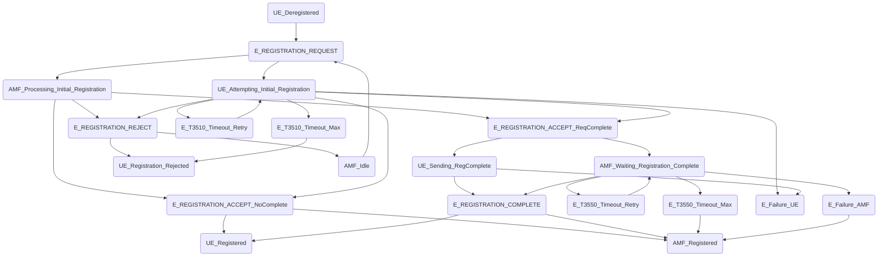

```mermaid
graph TD;
  %% Procedure: Registration procedure for initial registration
  A(UE_Deregistered);
  B(UE_Attempting_Initial_Registration);
  C(UE_Sending_RegComplete);
  D(UE_Registered);
  E(UE_Registration_Rejected);
  F(AMF_Idle);
  G(AMF_Processing_Initial_Registration);
  H(AMF_Waiting_Registration_Complete);
  I(AMF_Registered);
  J(E_REGISTRATION_REQUEST);
  K(E_REGISTRATION_ACCEPT_ReqComplete);
  L(E_REGISTRATION_ACCEPT_NoComplete);
  M(E_REGISTRATION_REJECT);
  N(E_REGISTRATION_COMPLETE);
  O(E_T3510_Timeout_Retry);
  P(E_T3510_Timeout_Max);
  Q(E_T3550_Timeout_Retry);
  R(E_T3550_Timeout_Max);
  S(E_Failure_UE);
  T(E_Failure_AMF);
  A --> J;
  J --> B;
  F --> J;
  J --> G;
  G --> K;
  K --> H;
  G --> L;
  L --> I;
  G --> M;
  M --> F;
  B --> K;
  K --> C;
  B --> L;
  L --> D;
  B --> M;
  M --> E;
  C --> N;
  N --> D;
  H --> N;
  N --> I;
  B --> O;
  O --> B;
  B --> P;
  P --> E;
  B --> S;
  C --> S;
  H --> Q;
  Q --> H;
  H --> R;
  R --> I;
  H --> T;
  T --> I;
```