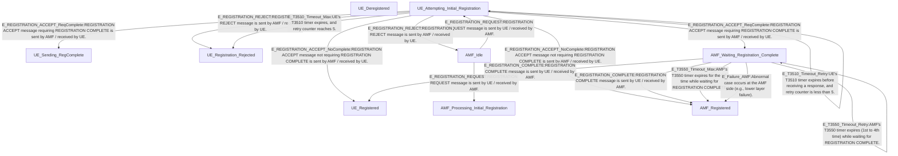

```mermaid
graph TD;
  UE_Deregistered;
  UE_Attempting_Initial_Registration;
  UE_Sending_RegComplete;
  UE_Registered;
  UE_Registration_Rejected;
  AMF_Idle;
  AMF_Processing_Initial_Registration;
  AMF_Waiting_Registration_Complete;
  AMF_Registered;
  AMF_Idle -- "E_REGISTRATION_REQUEST:REGISTRATION REQUEST message is sent by UE / received by AMF." --> UE_Attempting_Initial_Registration;
  AMF_Idle -- "E_REGISTRATION_REQUEST:REGISTRATION REQUEST message is sent by UE / received by AMF." --> AMF_Processing_Initial_Registration;
  UE_Attempting_Initial_Registration -- "E_REGISTRATION_ACCEPT_ReqComplete:REGISTRATION ACCEPT message requiring REGISTRATION COMPLETE is sent by AMF / received by UE." --> AMF_Waiting_Registration_Complete;
  UE_Attempting_Initial_Registration -- "E_REGISTRATION_ACCEPT_NoComplete:REGISTRATION ACCEPT message not requiring REGISTRATION COMPLETE is sent by AMF / received by UE." --> AMF_Registered;
  UE_Attempting_Initial_Registration -- "E_REGISTRATION_REJECT:REGISTRATION REJECT message is sent by AMF / received by UE." --> AMF_Idle;
  UE_Attempting_Initial_Registration -- "E_REGISTRATION_ACCEPT_ReqComplete:REGISTRATION ACCEPT message requiring REGISTRATION COMPLETE is sent by AMF / received by UE." --> UE_Sending_RegComplete;
  UE_Attempting_Initial_Registration -- "E_REGISTRATION_ACCEPT_NoComplete:REGISTRATION ACCEPT message not requiring REGISTRATION COMPLETE is sent by AMF / received by UE." --> UE_Registered;
  UE_Attempting_Initial_Registration -- "E_REGISTRATION_REJECT:REGISTRATION REJECT message is sent by AMF / received by UE." --> UE_Registration_Rejected;
  AMF_Waiting_Registration_Complete -- "E_REGISTRATION_COMPLETE:REGISTRATION COMPLETE message is sent by UE / received by AMF." --> UE_Registered;
  AMF_Waiting_Registration_Complete -- "E_REGISTRATION_COMPLETE:REGISTRATION COMPLETE message is sent by UE / received by AMF." --> AMF_Registered;
  UE_Attempting_Initial_Registration -- "E_T3510_Timeout_Retry:UE's T3510 timer expires before receiving a response, and retry counter is less than 5." --> UE_Attempting_Initial_Registration;
  UE_Attempting_Initial_Registration -- "E_T3510_Timeout_Max:UE's T3510 timer expires, and retry counter reaches 5." --> UE_Registration_Rejected;
  AMF_Waiting_Registration_Complete -- "E_T3550_Timeout_Retry:AMF's T3550 timer expires (1st to 4th time) while waiting for REGISTRATION COMPLETE." --> AMF_Waiting_Registration_Complete;
  AMF_Waiting_Registration_Complete -- "E_T3550_Timeout_Max:AMF's T3550 timer expires for the 5th time while waiting for REGISTRATION COMPLETE." --> AMF_Registered;
  AMF_Waiting_Registration_Complete -- "E_Failure_AMF:Abnormal case occurs at the AMF side (e.g., lower layer failure)." --> AMF_Registered;
```
