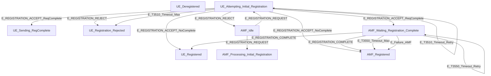

```mermaid
graph TD;
  UE_Deregistered;
  UE_Attempting_Initial_Registration;
  UE_Sending_RegComplete;
  UE_Registered;
  UE_Registration_Rejected;
  AMF_Idle;
  AMF_Processing_Initial_Registration;
  AMF_Waiting_Registration_Complete;
  AMF_Registered;
  AMF_Idle -- "E_REGISTRATION_REQUEST" --> UE_Attempting_Initial_Registration;
  AMF_Idle -- "E_REGISTRATION_REQUEST" --> AMF_Processing_Initial_Registration;
  UE_Attempting_Initial_Registration -- "E_REGISTRATION_ACCEPT_ReqComplete" --> AMF_Waiting_Registration_Complete;
  UE_Attempting_Initial_Registration -- "E_REGISTRATION_ACCEPT_NoComplete" --> AMF_Registered;
  UE_Attempting_Initial_Registration -- "E_REGISTRATION_REJECT" --> AMF_Idle;
  UE_Attempting_Initial_Registration -- "E_REGISTRATION_ACCEPT_ReqComplete" --> UE_Sending_RegComplete;
  UE_Attempting_Initial_Registration -- "E_REGISTRATION_ACCEPT_NoComplete" --> UE_Registered;
  UE_Attempting_Initial_Registration -- "E_REGISTRATION_REJECT" --> UE_Registration_Rejected;
  AMF_Waiting_Registration_Complete -- "E_REGISTRATION_COMPLETE" --> UE_Registered;
  AMF_Waiting_Registration_Complete -- "E_REGISTRATION_COMPLETE" --> AMF_Registered;
  UE_Attempting_Initial_Registration -- "E_T3510_Timeout_Retry" --> UE_Attempting_Initial_Registration;
  UE_Attempting_Initial_Registration -- "E_T3510_Timeout_Max" --> UE_Registration_Rejected;
  AMF_Waiting_Registration_Complete -- "E_T3550_Timeout_Retry" --> AMF_Waiting_Registration_Complete;
  AMF_Waiting_Registration_Complete -- "E_T3550_Timeout_Max" --> AMF_Registered;
  AMF_Waiting_Registration_Complete -- "E_Failure_AMF" --> AMF_Registered;
```
