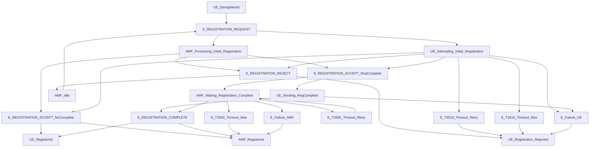

```mermaid
graph TD;
  UE_Deregistered;
  UE_Attempting_Initial_Registration;
  UE_Sending_RegComplete;
  UE_Registered;
  UE_Registration_Rejected;
  AMF_Idle;
  AMF_Processing_Initial_Registration;
  AMF_Waiting_Registration_Complete;
  AMF_Registered;
  E_REGISTRATION_REQUEST;
  E_REGISTRATION_ACCEPT_ReqComplete;
  E_REGISTRATION_ACCEPT_NoComplete;
  E_REGISTRATION_REJECT;
  E_REGISTRATION_COMPLETE;
  E_T3510_Timeout_Retry;
  E_T3510_Timeout_Max;
  E_T3550_Timeout_Retry;
  E_T3550_Timeout_Max;
  E_Failure_UE;
  E_Failure_AMF;
  UE_Deregistered -->E_REGISTRATION_REQUEST;
  E_REGISTRATION_REQUEST -->UE_Attempting_Initial_Registration;
  AMF_Idle -->E_REGISTRATION_REQUEST;
  E_REGISTRATION_REQUEST -->AMF_Processing_Initial_Registration;
  AMF_Processing_Initial_Registration -->E_REGISTRATION_ACCEPT_ReqComplete;
  E_REGISTRATION_ACCEPT_ReqComplete -->AMF_Waiting_Registration_Complete;
  AMF_Processing_Initial_Registration -->E_REGISTRATION_ACCEPT_NoComplete;
  E_REGISTRATION_ACCEPT_NoComplete -->AMF_Registered;
  AMF_Processing_Initial_Registration -->E_REGISTRATION_REJECT;
  E_REGISTRATION_REJECT -->AMF_Idle;
  UE_Attempting_Initial_Registration -->E_REGISTRATION_ACCEPT_ReqComplete;
  E_REGISTRATION_ACCEPT_ReqComplete -->UE_Sending_RegComplete;
  UE_Attempting_Initial_Registration -->E_REGISTRATION_ACCEPT_NoComplete;
  E_REGISTRATION_ACCEPT_NoComplete -->UE_Registered;
  UE_Attempting_Initial_Registration -->E_REGISTRATION_REJECT;
  E_REGISTRATION_REJECT -->UE_Registration_Rejected;
  UE_Sending_RegComplete -->E_REGISTRATION_COMPLETE;
  E_REGISTRATION_COMPLETE -->UE_Registered;
  AMF_Waiting_Registration_Complete -->E_REGISTRATION_COMPLETE;
  E_REGISTRATION_COMPLETE -->AMF_Registered;
  UE_Attempting_Initial_Registration -->E_T3510_Timeout_Retry;
  E_T3510_Timeout_Retry -->UE_Registration_Rejected;
  UE_Attempting_Initial_Registration -->E_T3510_Timeout_Max;
  E_T3510_Timeout_Max -->UE_Registration_Rejected;
  UE_Attempting_Initial_Registration -->E_Failure_UE;
  E_Failure_UE -->UE_Registration_Rejected;
  UE_Sending_RegComplete -->E_Failure_UE;
  AMF_Waiting_Registration_Complete -->E_T3550_Timeout_Retry;
  E_T3550_Timeout_Retry -->AMF_Waiting_Registration_Complete;
  AMF_Waiting_Registration_Complete -->E_T3550_Timeout_Max;
  E_T3550_Timeout_Max -->AMF_Registered;
  AMF_Waiting_Registration_Complete -->E_Failure_AMF;
  E_Failure_AMF -->AMF_Registered;
```
