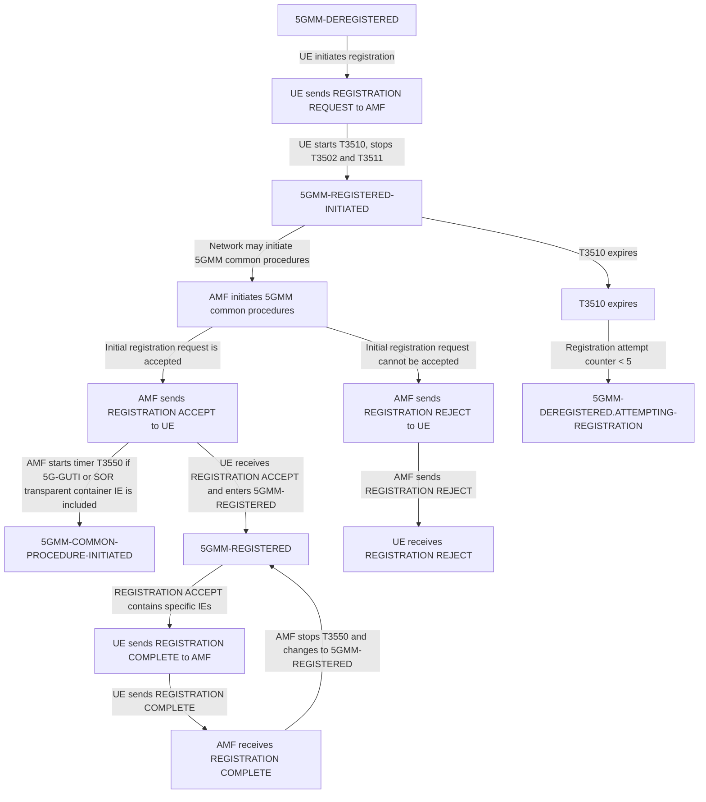

```mermaid
graph TD;
  state1["5GMM-DEREGISTERED"];
  event1["UE sends REGISTRATION REQUEST to AMF"];
  state2["5GMM-REGISTERED-INITIATED"];
  event2["AMF initiates 5GMM common procedures"];
  event3["AMF sends REGISTRATION ACCEPT to UE"];
  state3["5GMM-COMMON-PROCEDURE-INITIATED"];
  state4["5GMM-REGISTERED"];
  event4["UE sends REGISTRATION COMPLETE to AMF"];
  event5["AMF receives REGISTRATION COMPLETE"];
  event6["AMF sends REGISTRATION REJECT to UE"];
  state5["UE receives REGISTRATION REJECT"];
  event7["T3510 expires"];
  state6["5GMM-DEREGISTERED.ATTEMPTING-REGISTRATION"];
  state1 -->|UE initiates registration| event1;
  event1 -->|UE starts T3510, stops T3502 and T3511| state2;
  state2 -->|Network may initiate 5GMM common procedures| event2;
  event2 -->|Initial registration request is accepted| event3;
  event3 -->|AMF starts timer T3550 if 5G-GUTI or SOR transparent container IE is included| state3;
  event3 -->|UE receives REGISTRATION ACCEPT and enters 5GMM-REGISTERED| state4;
  state4 -->|REGISTRATION ACCEPT contains specific IEs| event4;
  event4 -->|UE sends REGISTRATION COMPLETE| event5;
  event5 -->|AMF stops T3550 and changes to 5GMM-REGISTERED| state4;
  event2 -->|Initial registration request cannot be accepted| event6;
  event6 -->|AMF sends REGISTRATION REJECT| state5;
  state2 -->|T3510 expires| event7;
  event7 -->|Registration attempt counter < 5| state6;
```
