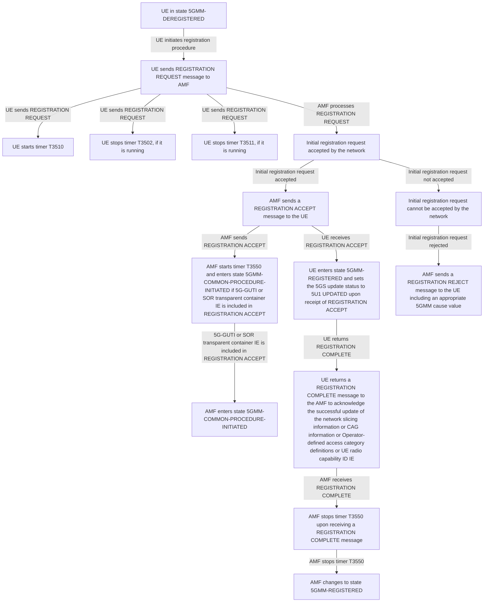

```mermaid
graph TD;
  state_deregistered["UE in state 5GMM-DEREGISTERED"];
  event_reg_request["UE sends REGISTRATION REQUEST message to AMF"];
  timer_start_t3510["UE starts timer T3510"];
  timer_stop_t3502["UE stops timer T3502, if it is running"];
  timer_stop_t3511["UE stops timer T3511, if it is running"];
  decision_initial_reg_accepted["Initial registration request accepted by the network"];
  event_reg_accept["AMF sends a REGISTRATION ACCEPT message to the UE"];
  timer_start_t3550["AMF starts timer T3550 and enters state 5GMM-COMMON-PROCEDURE-INITIATED if 5G-GUTI or SOR transparent container IE is included in REGISTRATION ACCEPT"];
  state_common_procedure_initiated["AMF enters state 5GMM-COMMON-PROCEDURE-INITIATED"];
  state_registered["UE enters state 5GMM-REGISTERED and sets the 5GS update status to 5U1 UPDATED upon receipt of REGISTRATION ACCEPT"];
  event_reg_complete["UE returns a REGISTRATION COMPLETE message to the AMF to acknowledge the successful update of the network slicing information or CAG information or Operator-defined access category definitions or UE radio capability ID IE"];
  timer_stop_t3550_amf["AMF stops timer T3550 upon receiving a REGISTRATION COMPLETE message"];
  state_registered_amf["AMF changes to state 5GMM-REGISTERED"];
  decision_initial_reg_rejected["Initial registration request cannot be accepted by the network"];
  event_reg_reject["AMF sends a REGISTRATION REJECT message to the UE including an appropriate 5GMM cause value"];
  state_deregistered -->|UE initiates registration procedure| event_reg_request;
  event_reg_request -->|UE sends REGISTRATION REQUEST| timer_start_t3510;
  event_reg_request -->|UE sends REGISTRATION REQUEST| timer_stop_t3502;
  event_reg_request -->|UE sends REGISTRATION REQUEST| timer_stop_t3511;
  event_reg_request -->|AMF processes REGISTRATION REQUEST| decision_initial_reg_accepted;
  decision_initial_reg_accepted -->|Initial registration request accepted| event_reg_accept;
  event_reg_accept -->|AMF sends REGISTRATION ACCEPT| timer_start_t3550;
  timer_start_t3550 -->|5G-GUTI or SOR transparent container IE is included in REGISTRATION ACCEPT| state_common_procedure_initiated;
  event_reg_accept -->|UE receives REGISTRATION ACCEPT| state_registered;
  state_registered -->|UE returns REGISTRATION COMPLETE| event_reg_complete;
  event_reg_complete -->|AMF receives REGISTRATION COMPLETE| timer_stop_t3550_amf;
  timer_stop_t3550_amf -->|AMF stops timer T3550| state_registered_amf;
  decision_initial_reg_accepted -->|Initial registration request not accepted| decision_initial_reg_rejected;
  decision_initial_reg_rejected -->|Initial registration request rejected| event_reg_reject;
```
