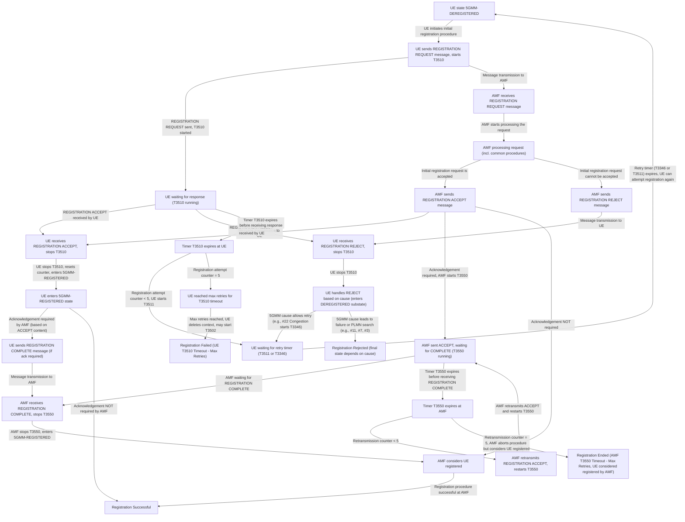

```mermaid
graph TD;
  state_deregistered["UE state 5GMM-DEREGISTERED"];
  event_ue_sends_reg_req["UE sends REGISTRATION REQUEST message, starts T3510"];
  state_ue_waiting_response["UE waiting for response (T3510 running)"];
  event_amf_receives_reg_req["AMF receives REGISTRATION REQUEST message"];
  state_amf_processing["AMF processing request (incl. common procedures)"];
  event_amf_sends_reg_accept["AMF sends REGISTRATION ACCEPT message"];
  event_amf_sends_reg_reject["AMF sends REGISTRATION REJECT message"];
  event_ue_receives_reg_accept["UE receives REGISTRATION ACCEPT, stops T3510"];
  state_ue_registered["UE enters 5GMM-REGISTERED state"];
  event_ue_sends_reg_complete["UE sends REGISTRATION COMPLETE message (if ack required)"];
  state_amf_waiting_complete["AMF sent ACCEPT, waiting for COMPLETE (T3550 running)"];
  event_amf_receives_reg_complete["AMF receives REGISTRATION COMPLETE, stops T3550"];
  state_amf_registered["AMF considers UE registered"];
  event_ue_receives_reg_reject["UE receives REGISTRATION REJECT, stops T3510"];
  state_ue_rejected["UE handles REJECT based on cause (enters DEREGISTERED substate)"];
  event_t3510_expires["Timer T3510 expires at UE"];
  state_ue_retry_wait["UE waiting for retry timer (T3511 or T3346)"];
  state_ue_max_retries["UE reached max retries for T3510 timeout"];
  event_t3550_expires["Timer T3550 expires at AMF"];
  event_amf_resends_reg_accept["AMF retransmits REGISTRATION ACCEPT, restarts T3550"];
  state_end_success["Registration Successful"];
  state_end_rejected["Registration Rejected (final state depends on cause)"];
  state_end_ue_timeout["Registration Failed (UE T3510 Timeout - Max Retries)"];
  state_end_amf_timeout["Registration Ended (AMF T3550 Timeout - Max Retries, UE considered registered by AMF)"];
  state_deregistered -->|UE initiates initial registration procedure| event_ue_sends_reg_req;
  event_ue_sends_reg_req -->|REGISTRATION REQUEST sent, T3510 started| state_ue_waiting_response;
  event_ue_sends_reg_req -->|Message transmission to AMF| event_amf_receives_reg_req;
  event_amf_receives_reg_req -->|AMF starts processing the request| state_amf_processing;
  state_amf_processing -->|Initial registration request is accepted| event_amf_sends_reg_accept;
  state_amf_processing -->|Initial registration request cannot be accepted| event_amf_sends_reg_reject;
  event_amf_sends_reg_accept -->|Message transmission to UE| event_ue_receives_reg_accept;
  state_ue_waiting_response -->|REGISTRATION ACCEPT received by UE| event_ue_receives_reg_accept;
  event_ue_receives_reg_accept -->|UE stops T3510, resets counter, enters 5GMM-REGISTERED| state_ue_registered;
  state_ue_registered -->|"Acknowledgement required by AMF (based on ACCEPT content)"| event_ue_sends_reg_complete;
  state_ue_registered -->|Acknowledgement NOT required by AMF| state_end_success;
  event_ue_sends_reg_complete -->|Message transmission to AMF| event_amf_receives_reg_complete;
  event_amf_sends_reg_accept -->|Acknowledgement required, AMF starts T3550| state_amf_waiting_complete;
  event_amf_sends_reg_accept -->|Acknowledgement NOT required| state_amf_registered;
  state_amf_waiting_complete -->|AMF waiting for REGISTRATION COMPLETE| event_amf_receives_reg_complete;
  event_amf_receives_reg_complete -->|AMF stops T3550, enters 5GMM-REGISTERED| state_amf_registered;
  state_amf_registered -->|Registration procedure successful at AMF| state_end_success;
  event_amf_sends_reg_reject -->|Message transmission to UE| event_ue_receives_reg_reject;
  state_ue_waiting_response -->|REGISTRATION REJECT received by UE| event_ue_receives_reg_reject;
  event_ue_receives_reg_reject -->|UE stops T3510| state_ue_rejected;
  state_ue_rejected -->|"5GMM cause allows retry (e.g., #22 Congestion starts T3346)"| state_ue_retry_wait;
  state_ue_rejected -->|"5GMM cause leads to failure or PLMN search (e.g., #11, #7, #3)"| state_end_rejected;
  state_ue_retry_wait -->|"Retry timer (T3346 or T3511) expires, UE can attempt registration again"| state_deregistered;
  state_ue_waiting_response -->|Timer T3510 expires before receiving response| event_t3510_expires;
  event_t3510_expires -->|Registration attempt counter < 5, UE starts T3511| state_ue_retry_wait;
  event_t3510_expires -->|Registration attempt counter = 5| state_ue_max_retries;
  state_ue_max_retries -->|Max retries reached, UE deletes context, may start T3502| state_end_ue_timeout;
  state_amf_waiting_complete -->|Timer T3550 expires before receiving REGISTRATION COMPLETE| event_t3550_expires;
  event_t3550_expires -->|Retransmission counter < 5| event_amf_resends_reg_accept;
  event_amf_resends_reg_accept -->|AMF retransmits ACCEPT and restarts T3550| state_amf_waiting_complete;
  event_t3550_expires -->|Retransmission counter = 5, AMF aborts procedure but considers UE registered| state_end_amf_timeout;
```
