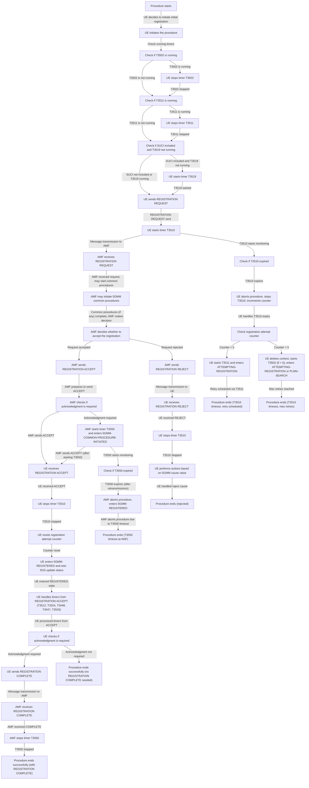

```mermaid
graph TD;
  start["Procedure starts"];
  1["UE initiates the procedure"];
  d_t3502["Check if T3502 is running"];
  2["UE stops timer T3502"];
  d_t3511["Check if T3511 is running"];
  3["UE stops timer T3511"];
  d_t3519["Check if SUCI included and T3519 not running"];
  4["UE starts timer T3519"];
  5["UE sends REGISTRATION REQUEST"];
  6["UE starts timer T3510"];
  7["AMF receives REGISTRATION REQUEST"];
  8["AMF may initiate 5GMM common procedures"];
  d_amf_accept["AMF decides whether to accept the registration"];
  9["AMF sends REGISTRATION ACCEPT"];
  d_amf_ack_req["AMF checks if acknowledgment is required"];
  10["AMF starts timer T3550 and enters 5GMM-COMMON-PROCEDURE-INITIATED"];
  11["UE receives REGISTRATION ACCEPT"];
  12["UE stops timer T3510"];
  13["UE resets registration attempt counter"];
  14["UE enters 5GMM-REGISTERED and sets 5GS update status"];
  15["UE handles timers from REGISTRATION ACCEPT (T3512, T3324, T3448, T3447, T3526)"];
  d_ue_ack_req["UE checks if acknowledgment is required"];
  16["UE sends REGISTRATION COMPLETE"];
  17["AMF receives REGISTRATION COMPLETE"];
  18["AMF stops timer T3550"];
  end_accept_complete["Procedure ends successfully (with REGISTRATION COMPLETE)"];
  end_accept_no_complete["Procedure ends successfully (no REGISTRATION COMPLETE needed)"];
  19["AMF sends REGISTRATION REJECT"];
  20["UE receives REGISTRATION REJECT"];
  21["UE stops timer T3510"];
  22["UE performs actions based on 5GMM cause value"];
  end_reject["Procedure ends (rejected)"];
  d_t3510_timeout["Check if T3510 expired"];
  23["UE aborts procedure, stops T3510, increments counter"];
  d_retry_counter["Check registration attempt counter"];
  24["UE starts T3511 and enters ATTEMPTING-REGISTRATION"];
  end_timeout_retry["Procedure ends (T3510 timeout, retry scheduled)"];
  25["UE deletes context, starts T3502 (if > 0), enters ATTEMPTING-REGISTRATION or PLMN-SEARCH"];
  end_timeout_fail["Procedure ends (T3510 timeout, max retries)"];
  d_t3550_timeout["Check if T3550 expired"];
  26["AMF aborts procedure, enters 5GMM-REGISTERED"];
  end_t3550_timeout["Procedure ends (T3550 timeout at AMF)"];
  start -->|UE decides to initiate initial registration| 1;
  1 -->|Check running timers| d_t3502;
  d_t3502 -->|T3502 is running| 2;
  2 -->|T3502 stopped| d_t3511;
  d_t3502 -->|T3502 is not running| d_t3511;
  d_t3511 -->|T3511 is running| 3;
  3 -->|T3511 stopped| d_t3519;
  d_t3511 -->|T3511 is not running| d_t3519;
  d_t3519 -->|SUCI included and T3519 not running| 4;
  4 -->|T3519 started| 5;
  d_t3519 -->|SUCI not included or T3519 running| 5;
  5 -->|REGISTRATION REQUEST sent| 6;
  6 -->|Message transmission to AMF| 7;
  7 -->|AMF received request, may start common procedures| 8;
  8 -->|"Common procedures (if any) complete, AMF makes decision"| d_amf_accept;
  d_amf_accept -->|Request accepted| 9;
  9 -->|AMF prepares to send ACCEPT| d_amf_ack_req;
  d_amf_ack_req -->|Acknowledgment required| 10;
  10 -->|"AMF sends ACCEPT (after starting T3550)"| 11;
  d_amf_ack_req -->|AMF sends ACCEPT| 11;
  11 -->|UE received ACCEPT| 12;
  12 -->|T3510 stopped| 13;
  13 -->|Counter reset| 14;
  14 -->|UE entered REGISTERED state| 15;
  15 -->|UE processed timers from ACCEPT| d_ue_ack_req;
  d_ue_ack_req -->|Acknowledgment required| 16;
  16 -->|Message transmission to AMF| 17;
  17 -->|AMF received COMPLETE| 18;
  18 -->|T3550 stopped| end_accept_complete;
  d_ue_ack_req -->|Acknowledgment not required| end_accept_no_complete;
  d_amf_accept -->|Request rejected| 19;
  19 -->|Message transmission to UE| 20;
  20 -->|UE received REJECT| 21;
  21 -->|T3510 stopped| 22;
  22 -->|UE handled reject cause| end_reject;
  6 -->|T3510 starts monitoring| d_t3510_timeout;
  d_t3510_timeout -->|T3510 expires| 23;
  23 -->|UE handles T3510 expiry| d_retry_counter;
  d_retry_counter -->|Counter < 5| 24;
  24 -->|Retry scheduled via T3511| end_timeout_retry;
  d_retry_counter -->|Counter = 5| 25;
  25 -->|Max retries reached| end_timeout_fail;
  10 -->|T3550 starts monitoring| d_t3550_timeout;
  d_t3550_timeout -->|"T3550 expires (after retransmissions)"| 26;
  26 -->|AMF aborts procedure due to T3550 timeout| end_t3550_timeout;
```
