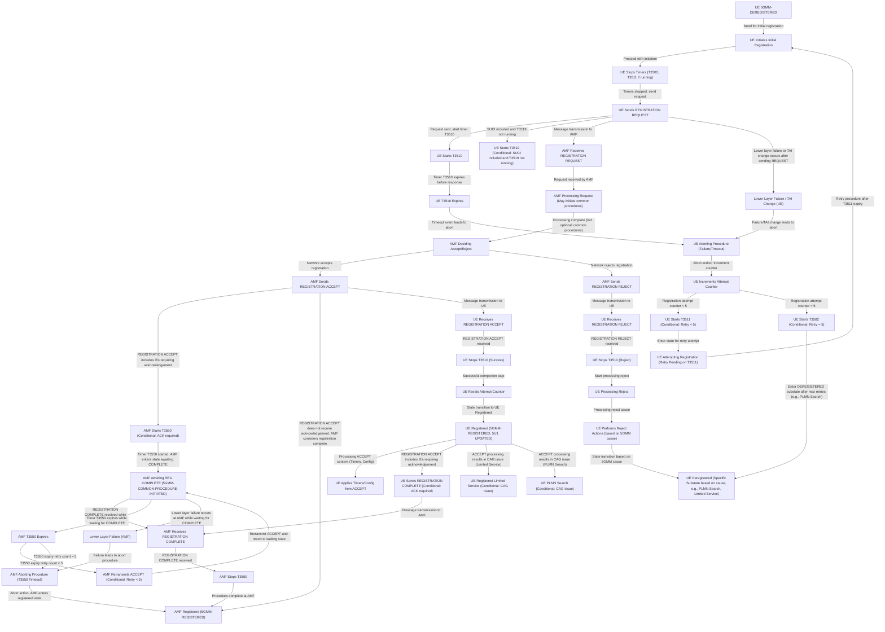

```mermaid
graph TD;
  S0["UE 5GMM-DEREGISTERED"];
  E1["UE Initiates Initial Registration"];
  E2["UE Stops Timers (T3502, T3511 if running)"];
  E3["UE Sends REGISTRATION REQUEST"];
  E4["UE Starts T3510"];
  E5["UE Starts T3519 (Conditional: SUCI included and T3519 not running)"];
  E6["AMF Receives REGISTRATION REQUEST"];
  S1["AMF Processing Request (May initiate common procedures)"];
  S2["AMF Deciding Accept/Reject"];
  E7["AMF Sends REGISTRATION ACCEPT"];
  E8["AMF Starts T3550 (Conditional: ACK required)"];
  S3["AMF Awaiting REG COMPLETE (5GMM-COMMON-PROCEDURE-INITIATED)"];
  E9["UE Receives REGISTRATION ACCEPT"];
  E10["UE Stops T3510 (Success)"];
  E11["UE Resets Attempt Counter"];
  S4["UE Registered (5GMM-REGISTERED, 5U1 UPDATED)"];
  E12["UE Applies Timers/Config from ACCEPT"];
  E13["UE Sends REGISTRATION COMPLETE (Conditional: ACK required)"];
  E14["AMF Receives REGISTRATION COMPLETE"];
  E15["AMF Stops T3550"];
  S5["AMF Registered (5GMM-REGISTERED)"];
  E16["AMF Sends REGISTRATION REJECT"];
  E17["UE Receives REGISTRATION REJECT"];
  E18["UE Stops T3510 (Reject)"];
  S6["UE Processing Reject"];
  E19["UE Performs Reject Actions (based on 5GMM cause)"];
  S7["UE Deregistered (Specific Substate based on cause, e.g., PLMN Search, Limited Service)"];
  E20["UE T3510 Expires"];
  S8["UE Aborting Procedure (Failure/Timeout)"];
  E21["UE Increments Attempt Counter"];
  E22["UE Starts T3511 (Conditional: Retry < 5)"];
  S9["UE Attempting Registration (Retry Pending on T3511)"];
  E23["UE Starts T3502 (Conditional: Retry = 5)"];
  E24["AMF T3550 Expires"];
  E25["AMF Retransmits ACCEPT (Conditional: Retry < 5)"];
  S10["AMF Aborting Procedure (T3550 Timeout)"];
  E26["Lower Layer Failure / TAI Change (UE)"];
  E27["Lower Layer Failure (AMF)"];
  S11["UE Registered Limited Service (Conditional: CAG Issue)"];
  S12["UE PLMN Search (Conditional: CAG Issue)"];
  S0 -->|Need for initial registration| E1;
  E1 -->|Proceed with initiation| E2;
  E2 -->|Timers stopped, send request| E3;
  E3 -->|Request sent, start timer T3510| E4;
  E3 -->|SUCI included and T3519 not running| E5;
  E3 -->|Message transmission to AMF| E6;
  E6 -->|Request received by AMF| S1;
  S1 -->|"Processing complete (incl. optional common procedures)"| S2;
  S2 -->|Network accepts registration| E7;
  S2 -->|Network rejects registration| E16;
  E7 -->|REGISTRATION ACCEPT includes IEs requiring acknowledgement| E8;
  E8 -->|Timer T3550 started, AMF enters state awaiting COMPLETE| S3;
  E7 -->|REGISTRATION ACCEPT does not require acknowledgement, AMF considers registration complete| S5;
  E7 -->|Message transmission to UE| E9;
  E9 -->|REGISTRATION ACCEPT received| E10;
  E10 -->|Successful completion step| E11;
  E11 -->|State transition to UE Registered| S4;
  S4 -->|"Processing ACCEPT content (Timers, Config)"| E12;
  S4 -->|REGISTRATION ACCEPT includes IEs requiring acknowledgement| E13;
  S4 -->|"ACCEPT processing results in CAG issue (Limited Service)"| S11;
  S4 -->|"ACCEPT processing results in CAG issue (PLMN Search)"| S12;
  E13 -->|Message transmission to AMF| E14;
  S3 -->|REGISTRATION COMPLETE received while AMF waiting| E14;
  E14 -->|REGISTRATION COMPLETE received| E15;
  E15 -->|Procedure complete at AMF| S5;
  E16 -->|Message transmission to UE| E17;
  E17 -->|REGISTRATION REJECT received| E18;
  E18 -->|Start processing reject| S6;
  S6 -->|Processing reject cause| E19;
  E19 -->|State transition based on 5GMM cause| S7;
  E4 -->|Timer T3510 expires before response| E20;
  E20 -->|Timeout event leads to abort| S8;
  E3 -->|Lower layer failure or TAI change occurs after sending REQUEST| E26;
  E26 -->|Failure/TAI change leads to abort| S8;
  S8 -->|Abort action: Increment counter| E21;
  E21 -->|Registration attempt counter < 5| E22;
  E22 -->|Enter state for retry attempt| S9;
  S9 -->|Retry procedure after T3511 expiry| E1;
  E21 -->|Registration attempt counter = 5| E23;
  E23 -->|"Enter DEREGISTERED substate after max retries (e.g., PLMN Search)"| S7;
  S3 -->|Timer T3550 expires while waiting for COMPLETE| E24;
  E24 -->|T3550 expiry retry count < 5| E25;
  E25 -->|Retransmit ACCEPT and return to waiting state| S3;
  E24 -->|T3550 expiry retry count = 5| S10;
  S10 -->|Abort action, AMF enters registered state| S5;
  S3 -->|Lower layer failure occurs at AMF while waiting for COMPLETE| E27;
  E27 -->|Failure leads to abort procedure| S10;
```

***error : 
E23 -->|Enter DEREGISTERED substate after max retries (e.g., PLMN Search)| S7;
should be 
E23 -->|"Enter DEREGISTERED substate after max retries (e.g., PLMN Search)"| S7;***