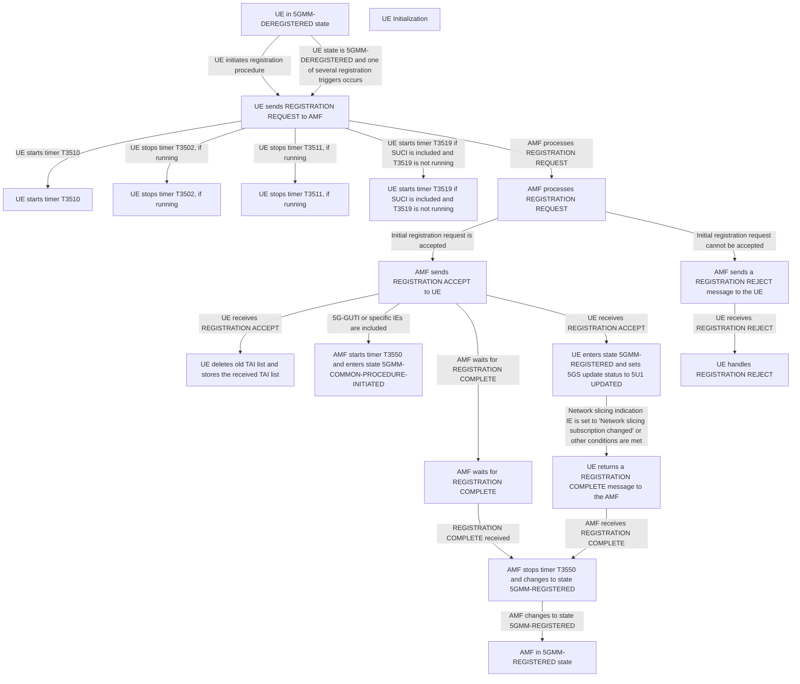

```mermaid
graph TD;
  UE_DEREGISTERED["UE in 5GMM-DEREGISTERED state"];
  REGISTRATION_REQUEST_SENT["UE sends REGISTRATION REQUEST to AMF"];
  T3510_start["UE starts timer T3510"];
  T3502_stop["UE stops timer T3502, if running"];
  T3511_stop["UE stops timer T3511, if running"];
  T3519_start["UE starts timer T3519 if SUCI is included and T3519 is not running"];
  AMF_processes_REGISTRATION_REQUEST["AMF processes REGISTRATION REQUEST"];
  REGISTRATION_ACCEPT_SENT["AMF sends REGISTRATION ACCEPT to UE"];
  UE_stores_TAI["UE deletes old TAI list and stores the received TAI list"];
  T3550_start["AMF starts timer T3550 and enters state 5GMM-COMMON-PROCEDURE-INITIATED"];
  UE_REGISTERED["UE enters state 5GMM-REGISTERED and sets 5GS update status to 5U1 UPDATED"];
  REGISTRATION_COMPLETE_sent["UE returns a REGISTRATION COMPLETE message to the AMF"];
  T3550_stop["AMF stops timer T3550 and changes to state 5GMM-REGISTERED"];
  AMF_REGISTERED["AMF in 5GMM-REGISTERED state"];
  REGISTRATION_REJECT_SENT["AMF sends a REGISTRATION REJECT message to the UE"];
  UE_Initialization["UE Initialization"];
  AMF_waits_for_REGISTRATION_COMPLETE["AMF waits for REGISTRATION COMPLETE"];
  UE_handles_REGISTRATION_REJECT["UE handles REGISTRATION REJECT"];
  UE_DEREGISTERED -->|UE initiates registration procedure| REGISTRATION_REQUEST_SENT;
  REGISTRATION_REQUEST_SENT -->|UE starts timer T3510| T3510_start;
  REGISTRATION_REQUEST_SENT -->|UE stops timer T3502, if running| T3502_stop;
  REGISTRATION_REQUEST_SENT -->|UE stops timer T3511, if running| T3511_stop;
  REGISTRATION_REQUEST_SENT -->|UE starts timer T3519 if SUCI is included and T3519 is not running| T3519_start;
  REGISTRATION_REQUEST_SENT -->|AMF processes REGISTRATION REQUEST| AMF_processes_REGISTRATION_REQUEST;
  AMF_processes_REGISTRATION_REQUEST -->|Initial registration request is accepted| REGISTRATION_ACCEPT_SENT;
  AMF_processes_REGISTRATION_REQUEST -->|Initial registration request cannot be accepted| REGISTRATION_REJECT_SENT;
  REGISTRATION_ACCEPT_SENT -->|UE receives REGISTRATION ACCEPT| UE_stores_TAI;
  REGISTRATION_ACCEPT_SENT -->|5G-GUTI or specific IEs are included| T3550_start;
  REGISTRATION_ACCEPT_SENT -->|AMF waits for REGISTRATION COMPLETE| AMF_waits_for_REGISTRATION_COMPLETE;
  REGISTRATION_ACCEPT_SENT -->|UE receives REGISTRATION ACCEPT| UE_REGISTERED;
  UE_REGISTERED -->|Network slicing indication IE is set to 'Network slicing subscription changed' or other conditions are met| REGISTRATION_COMPLETE_sent;
  REGISTRATION_COMPLETE_sent -->|AMF receives REGISTRATION COMPLETE| T3550_stop;
  T3550_stop -->|AMF changes to state 5GMM-REGISTERED| AMF_REGISTERED;
  REGISTRATION_REJECT_SENT -->|UE receives REGISTRATION REJECT| UE_handles_REGISTRATION_REJECT;
  UE_DEREGISTERED -->|UE state is 5GMM-DEREGISTERED and one of several registration triggers occurs| REGISTRATION_REQUEST_SENT;
  AMF_waits_for_REGISTRATION_COMPLETE -->|REGISTRATION COMPLETE received| T3550_stop;
```
