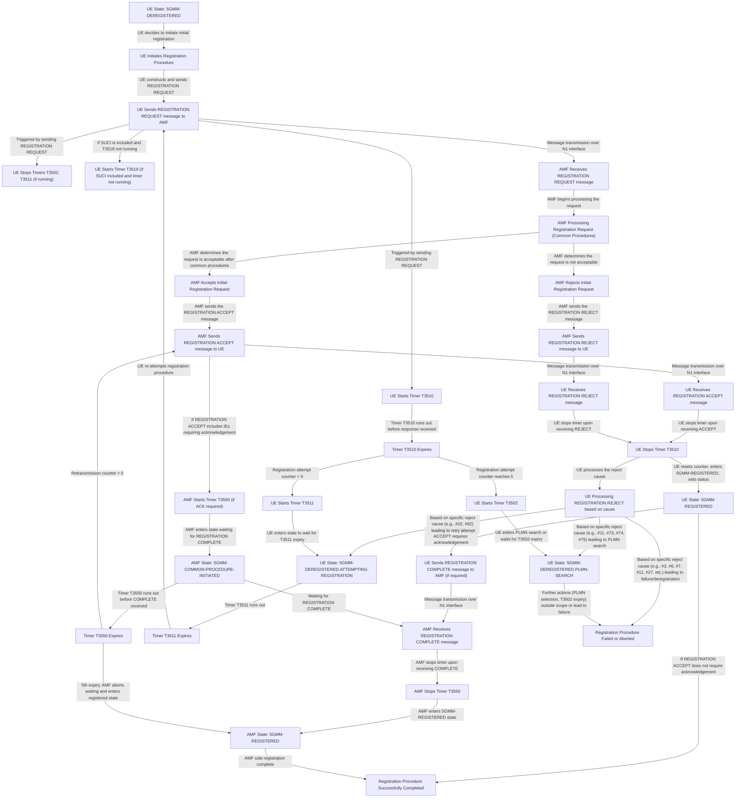

***error :
 state_ue_processing_reject -->|Based on specific reject cause (e.g., #11, #73, #74, #75) leading to PLMN search| state_ue_plmn_search;
 should be 
state_ue_processing_reject -->|"Based on specific reject cause (e.g., #11, #73, #74, #75) leading to PLMN search"| state_ue_plmn_search;

***