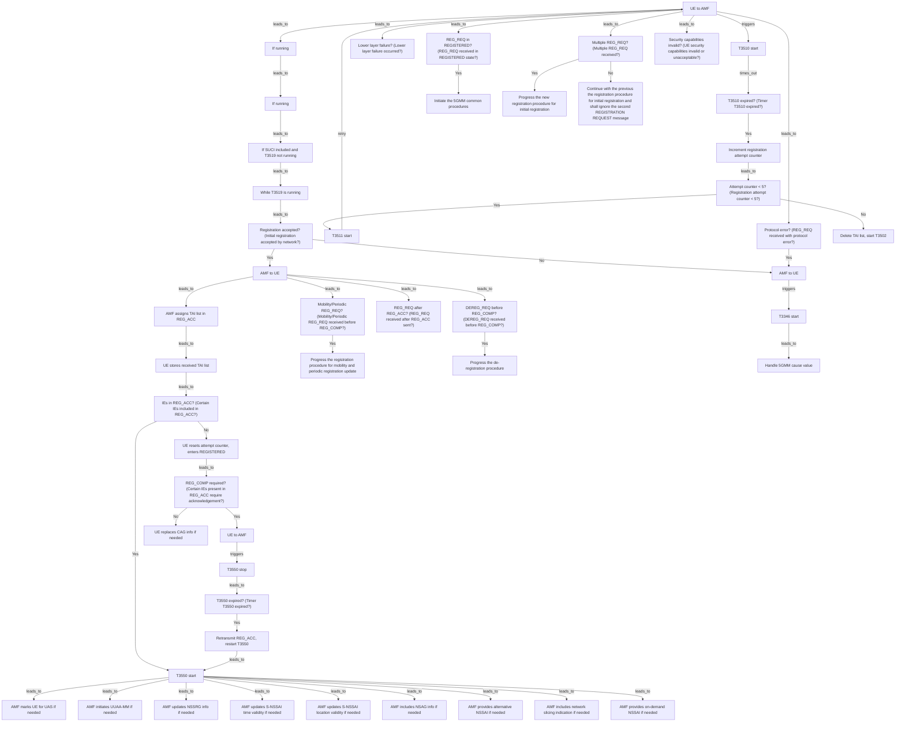

```mermaid
graph TD;
    1["UE to AMF"];
    2["T3510 start"];
    3["If running"];
    4["If running"];
    5["If SUCI included and T3519 not running"];
    6["While T3519 is running"];
    7["Registration accepted? (Initial registration accepted by network?)"];
    8["AMF to UE"];
    9["AMF assigns TAI list in REG_ACC"];
    10["UE stores received TAI list"];
    11["IEs in REG_ACC? (Certain IEs included in REG_ACC?)"];
    12["T3550 start"];
    13["AMF marks UE for UAS if needed"];
    14["AMF initiates UUAA-MM if needed"];
    15["AMF updates NSSRG info if needed"];
    16["AMF updates S-NSSAI time validity if needed"];
    17["AMF updates S-NSSAI location validity if needed"];
    18["AMF includes NSAG info if needed"];
    19["AMF provides alternative NSSAI if needed"];
    20["AMF includes network slicing indication if needed"];
    21["AMF provides on-demand NSSAI if needed"];
    22["UE resets attempt counter, enters REGISTERED"];
    23["UE to AMF"];
    24["UE replaces CAG info if needed"];
    25["T3550 stop"];
    26["AMF to UE"];
    27["T3510 expired? (Timer T3510 expired?)"];
    28["Increment registration attempt counter"];
    29["Attempt counter < 5? (Registration attempt counter < 5?)"];
    30["T3511 start"];
    31["T3346 start"];
    32["T3550 expired? (Timer T3550 expired?)"];
    33["Retransmit REG_ACC, restart T3550"];
    34["Lower layer failure? (Lower layer failure occurred?)"];
    35["Protocol error? (REG_REQ received with protocol error?)"];
    36["REG_REQ after REG_ACC? (REG_REQ received after REG_ACC sent?)"];
    37["Multiple REG_REQ? (Multiple REG_REQ received?)"];
    38["REG_REQ in REGISTERED? (REG_REQ received in REGISTERED state?)"];
    39["Mobility/Periodic REG_REQ? (Mobility/Periodic REG_REQ received before REG_COMP?)"];
    40["DEREG_REQ before REG_COMP? (DEREG_REQ received before REG_COMP?)"];
    41["Security capabilities invalid? (UE security capabilities invalid or unacceptable?)"];
    42["Delete TAI list, start T3502"];
    43["REG_COMP required? (Certain IEs present in REG_ACC require acknowledgement?)"];
    44["Initiate the 5GMM common procedures"];
    45["Progress the new registration procedure for initial registration"];
    46["Continue with the previous the registration procedure for initial registration and shall ignore the second REGISTRATION REQUEST message"];
    47["Progress the registration procedure for mobility and periodic registration update"];
    48["Progress the de-registration procedure"];
    49["Handle 5GMM cause value"];
    1 -->|triggers| 2;
    1 -->|leads_to| 3;
    3 -->|leads_to| 4;
    4 -->|leads_to| 5;
    5 -->|leads_to| 6;
    6 -->|leads_to| 7;
    7 -->|Yes| 8;
    8 -->|leads_to| 9;
    9 -->|leads_to| 10;
    10 -->|leads_to| 11;
    11 -->|Yes| 12;
    11 -->|No| 22;
    12 -->|leads_to| 13;
    12 -->|leads_to| 14;
    12 -->|leads_to| 15;
    12 -->|leads_to| 16;
    12 -->|leads_to| 17;
    12 -->|leads_to| 18;
    12 -->|leads_to| 19;
    12 -->|leads_to| 20;
    12 -->|leads_to| 21;
    22 -->|leads_to| 43;
    43 -->|Yes| 23;
    43 -->|No| 24;
    23 -->|triggers| 25;
    25 -->|leads_to| 32;
    7 -->|No| 26;
    26 -->|triggers| 31;
    2 -->|times_out| 27;
    27 -->|Yes| 28;
    28 -->|leads_to| 29;
    29 -->|Yes| 30;
    29 -->|No| 42;
    30 -->|retry| 1;
    32 -->|Yes| 33;
    33 -->|leads_to| 12;
    1 -->|leads_to| 34;
    1 -->|leads_to| 35;
    8 -->|leads_to| 36;
    1 -->|leads_to| 37;
    1 -->|leads_to| 38;
    8 -->|leads_to| 39;
    8 -->|leads_to| 40;
    1 -->|leads_to| 41;
    35 -->|Yes| 26;
    38 -->|Yes| 44;
    37 -->|Yes| 45;
    37 -->|No| 46;
    39 -->|Yes| 47;
    40 -->|Yes| 48;
    31 -->|leads_to| 49;
```
