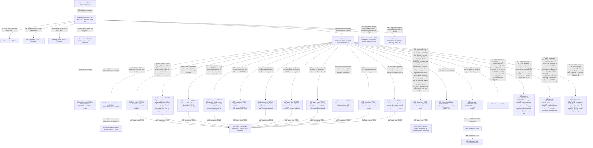

```mermaid
graph TD;
  5GMM-DEREGISTERED["UE in state 5GMM-DEREGISTERED"];
  REGISTRATION_REQUEST["UE sends REGISTRATION REQUEST message to the AMF"];
  T3510_start["UE starts timer T3510"];
  T3502_stop["UE stops timer T3502 if running"];
  T3511_stop["UE stops timer T3511 if running"];
  T3519_start["UE starts timer T3519 if SUCI included and timer not running"];
  SUCI_included["UE includes stored SUCI in REGISTRATION REQUEST while T3519 is running"];
  REGISTRATION_ACCEPT["AMF sends REGISTRATION ACCEPT message to the UE"];
  TAI_list_assigned["AMF assigns and includes a TAI list in REGISTRATION ACCEPT"];
  TAI_list_stored["UE deletes old TAI list and stores received TAI list"];
  T3550_start_1["AMF starts timer T3550 if 5G-GUTI or SOR transparent container IE is included"];
  5GMM-COMMON-PROCEDURE-INITIATED["AMF enters state 5GMM-COMMON-PROCEDURE-INITIATED"];
  T3550_start_2["AMF starts timer T3550 if Operator-defined access category definitions IE, the Extended emergency number list IE, the CAG information list IE or the Extended CAG information list IE are included"];
  T3550_start_3["AMF starts timer T3550 if UE has set RCMAP bit and Negotiated PEIPS assistance information IE is included"];
  T3550_start_4["AMF starts timer T3550 if UE is not in NB-N1 mode, has set RACS bit, and UE radio capability ID IE or deletion indication IE is included"];
  UAS_services_allowed["AMF marks in UE's 5GMM context that the UE is not allowed to request UAS services"];
  T3550_start_5["AMF starts timer T3550 and initiates UUAA-MM procedure if conditions are met"];
  UUAA_procedure_pending["AMF stores in the UE 5GMM context that a UUAA procedure is pending"];
  T3550_start_6["AMF starts timer T3550 if AMF needs to update NSSRG information and UE has set NSSRG bit"];
  T3550_start_7["AMF starts timer T3550 if UE supports S-NSSAI time validity information and AMF needs to update it"];
  T3550_start_8["AMF starts timer T3550 if UE supports S-NSSAI location validity information and AMF needs to update it"];
  T3550_start_9["AMF starts timer T3550 if UE has set NSAG bit and RCMAN bit and NSAG information IE is included"];
  T3550_start_10["AMF starts timer T3550 if UE supports network slice replacement and AMF determines to provide the mapping information"];
  T3550_start_11["AMF starts timer T3550 if UDM indicates subscription data change for network slicing"];
  T3550_start_12["AMF starts timer T3550 if UE indicates support for network slice usage control and AMF determines to provide on-demand NSSAI"];
  5GMM-REGISTERED["UE enters state 5GMM-REGISTERED and sets 5GS update status to 5U1 UPDATED"];
  REGISTRATION_COMPLETE["UE returns a REGISTRATION COMPLETE message to the AMF"];
  CAG_information_list_replaced["UE replaces the CAG information list"];
  REGISTRATION_COMPLETE_acknowledged["UE returns a REGISTRATION COMPLETE message to the AMF to acknowledge reception of the operator-defined access category definitions, the extended local emergency numbers list or the "CAG information list""];
  REGISTRATION_COMPLETE_acknowledged_PEIPS["UE returns REGISTRATION COMPLETE message to the AMF to acknowledge the reception of the Negotiated PEIPS assistance information IE"];
  REGISTRATION_COMPLETE_acknowledged_radio["UE returns a REGISTRATION COMPLETE message to the AMF to acknowledge reception of the UE radio capability ID IE or the UE radio capability ID deletion indication IE"];
  T3550_stop["AMF stops timer T3550"];
  5GMM-REGISTERED_AMF["AMF changes to state 5GMM-REGISTERED"];
  REGISTRATION_REJECT["AMF sends a REGISTRATION REJECT message to the UE"];
  5GMM-DEREGISTERED -->|UE initiates registration procedure| REGISTRATION_REQUEST;
  REGISTRATION_REQUEST -->|UE sends REGISTRATION REQUEST| T3510_start;
  REGISTRATION_REQUEST -->|UE sends REGISTRATION REQUEST| T3502_stop;
  REGISTRATION_REQUEST -->|UE sends REGISTRATION REQUEST| T3511_stop;
  REGISTRATION_REQUEST -->|UE sends REGISTRATION REQUEST| T3519_start;
  T3519_start -->|Timer T3519 is running| SUCI_included;
  REGISTRATION_REQUEST -->|Initial registration request is accepted by the network| REGISTRATION_ACCEPT;
  REGISTRATION_ACCEPT -->|AMF sends REGISTRATION ACCEPT| TAI_list_assigned;
  TAI_list_assigned -->|UE receives REGISTRATION ACCEPT| TAI_list_stored;
  REGISTRATION_ACCEPT -->|5G-GUTI or SOR transparent container IE is included| T3550_start_1;
  T3550_start_1 -->|AMF starts timer T3550| 5GMM-COMMON-PROCEDURE-INITIATED;
  REGISTRATION_ACCEPT -->|Operator-defined access category definitions IE, the Extended emergency number list IE, the CAG information list IE or the Extended CAG information list IE are included| T3550_start_2;
  T3550_start_2 -->|AMF starts timer T3550| 5GMM-COMMON-PROCEDURE-INITIATED;
  REGISTRATION_ACCEPT -->|UE has set RCMAP bit and Negotiated PEIPS assistance information IE is included| T3550_start_3;
  T3550_start_3 -->|AMF starts timer T3550| 5GMM-COMMON-PROCEDURE-INITIATED;
  REGISTRATION_ACCEPT -->|UE is not in NB-N1 mode, has set RACS bit, and UE radio capability ID IE or deletion indication IE is included| T3550_start_4;
  T3550_start_4 -->|AMF starts timer T3550| 5GMM-COMMON-PROCEDURE-INITIATED;
  REGISTRATION_REQUEST -->|AMF determines that the UUAA-MM procedure needs to be performed for a UE| UAS_services_allowed;
  REGISTRATION_ACCEPT -->|UE has included the service-level device ID set to the CAA-level UAV ID in the Service-level-AA container IE of the REGISTRATION REQUEST message, and if: - the UE has a valid aerial UE subscription information; - the UUAA procedure is to be performed during the registration procedure according to operator policy; - there is no valid successful UUAA result for the UE in the UE 5GMM context; and - the REGISTRATION REQUEST message was not received over non-3GPP access| T3550_start_5;
  T3550_start_5 -->|AMF starts timer T3550| UUAA_procedure_pending;
  REGISTRATION_ACCEPT -->|AMF needs to update the NSSRG information and UE has set NSSRG bit| T3550_start_6;
  T3550_start_6 -->|AMF starts timer T3550| 5GMM-COMMON-PROCEDURE-INITIATED;
  REGISTRATION_ACCEPT -->|UE supports S-NSSAI time validity information and AMF needs to update it| T3550_start_7;
  T3550_start_7 -->|AMF starts timer T3550| 5GMM-COMMON-PROCEDURE-INITIATED;
  REGISTRATION_ACCEPT -->|UE supports S-NSSAI location validity information and AMF needs to update it| T3550_start_8;
  T3550_start_8 -->|AMF starts timer T3550| 5GMM-COMMON-PROCEDURE-INITIATED;
  REGISTRATION_ACCEPT -->|UE has set NSAG bit and RCMAN bit and NSAG information IE is included| T3550_start_9;
  T3550_start_9 -->|AMF starts timer T3550| 5GMM-COMMON-PROCEDURE-INITIATED;
  REGISTRATION_ACCEPT -->|UE supports network slice replacement and AMF determines to provide the mapping information| T3550_start_10;
  T3550_start_10 -->|AMF starts timer T3550| 5GMM-COMMON-PROCEDURE-INITIATED;
  REGISTRATION_ACCEPT -->|UDM indicates subscription data change for network slicing| T3550_start_11;
  T3550_start_11 -->|AMF starts timer T3550| 5GMM-COMMON-PROCEDURE-INITIATED;
  REGISTRATION_ACCEPT -->|UE indicates support for network slice usage control and AMF determines to provide on-demand NSSAI| T3550_start_12;
  T3550_start_12 -->|AMF starts timer T3550| 5GMM-COMMON-PROCEDURE-INITIATED;
  REGISTRATION_ACCEPT -->|UE receives REGISTRATION ACCEPT| 5GMM-REGISTERED;
  REGISTRATION_ACCEPT -->|Certain IEs present in REGISTRATION ACCEPT require acknowledgement| REGISTRATION_COMPLETE;
  REGISTRATION_ACCEPT -->|The REGISTRATION ACCEPT message contains the CAG information list IE or the Extended CAG information list IE and the UE had set the CAG bit to 'CAG supported' in the 5GMM capability IE of the REGISTRATION REQUEST message| CAG_information_list_replaced;
  REGISTRATION_ACCEPT -->|The REGISTRATION ACCEPT message contains the Operator-defined access category definitions IE, the Extended emergency number list IE ,the CAG information list IE or the Extended CAG information list IE| REGISTRATION_COMPLETE_acknowledged;
  REGISTRATION_ACCEPT -->|The UE has set the RCMAP bit to 'Sending of REGISTRATION COMPLETE message for negotiated PEIPS parameters supported' in the 5GMM capability IE of the REGISTRATION REQUEST message and if REGISTRATION ACCEPT message contains the Negotiated PEIPS assistance information IE| REGISTRATION_COMPLETE_acknowledged_PEIPS;
  REGISTRATION_ACCEPT -->|The REGISTRATION ACCEPT message contains the UE radio capability ID IE or the UE radio capability ID deletion indication IE| REGISTRATION_COMPLETE_acknowledged_radio;
  REGISTRATION_COMPLETE -->|UE sends REGISTRATION COMPLETE| T3550_stop;
  T3550_stop -->|AMF stops timer T3550| 5GMM-REGISTERED_AMF;
  REGISTRATION_REQUEST -->|Initial registration request cannot be accepted by the network| REGISTRATION_REJECT;
```
