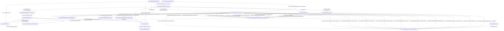

```mermaid
graph TD
    UE_5GMM_DEREGISTERED
    UE_5GMM_REGISTERED_INITIATED
    UE_5GMM_REGISTERED
    UE_5GMM_DEREGISTERED_ATTEMPTING_REGISTRATION
    UE_5GMM_DEREGISTERED_LIMITED_SERVICE
    UE_5GMM_DEREGISTERED_PLMN_SEARCH
    UE_5GMM_DEREGISTERED_NO_SUPI
    UE_5GMM_DEREGISTERED_NO_CELL_AVAILABLE
    UE_Needs_Mobility_Update
    Event_Trigger_Initial_Registration
    Event_REGISTRATION_ACCEPT_Received
    Event_REGISTRATION_REJECT_Received
    Event_T3510_Timeout
    Event_T3511_Timeout
    Event_T3502_Timeout
    Event_LowerLayer_Failure
    Event_TAI_Change
    Event_Transmission_Failure_REG_COMPLETE
    UE_5GMM_DEREGISTERED -->|"Send_REGISTRATION_REQUEST_Start_Timers"| UE_5GMM_REGISTERED_INITIATED
    UE_5GMM_DEREGISTERED -->|"Defer_Registration"| UE_5GMM_DEREGISTERED
    UE_5GMM_DEREGISTERED -->|"Defer_Registration"| UE_5GMM_DEREGISTERED
    UE_5GMM_REGISTERED_INITIATED -->|"Network sends REGISTRATION ACCEPT"| Event_REGISTRATION_ACCEPT_Received
    Event_REGISTRATION_ACCEPT_Received -->|"Process_REGISTRATION_ACCEPT"| UE_5GMM_REGISTERED
    UE_5GMM_REGISTERED -->|"Send_REGISTRATION_COMPLETE"| UE_5GMM_REGISTERED
    UE_5GMM_REGISTERED_INITIATED -->|"Network sends REGISTRATION REJECT"| Event_REGISTRATION_REJECT_Received
    Event_REGISTRATION_REJECT_Received -->|"Process_REGISTRATION_REJECT_Illegal"| UE_5GMM_DEREGISTERED_NO_SUPI
    Event_REGISTRATION_REJECT_Received -->|"Process_REGISTRATION_REJECT_PLMN_NotAllowed"| UE_5GMM_DEREGISTERED_PLMN_SEARCH
    Event_REGISTRATION_REJECT_Received -->|"Process_REGISTRATION_REJECT_TA_NotAllowed"| UE_5GMM_DEREGISTERED_LIMITED_SERVICE
    Event_REGISTRATION_REJECT_Received -->|"Process_REGISTRATION_REJECT_Roaming_NotAllowed"| UE_5GMM_DEREGISTERED_LIMITED_SERVICE
    Event_REGISTRATION_REJECT_Received -->|"Process_REGISTRATION_REJECT_Congestion"| UE_5GMM_DEREGISTERED_ATTEMPTING_REGISTRATION
    Event_REGISTRATION_REJECT_Received -->|"Process_REGISTRATION_REJECT_N1_NotAllowed"| UE_5GMM_DEREGISTERED_LIMITED_SERVICE
    Event_REGISTRATION_REJECT_Received -->|"Process_REGISTRATION_REJECT_RedirectToEPC"| UE_5GMM_DEREGISTERED_NO_CELL_AVAILABLE
    Event_REGISTRATION_REJECT_Received -->|"Process_REGISTRATION_REJECT_NoSlices_Retry"| UE_5GMM_DEREGISTERED_ATTEMPTING_REGISTRATION
    Event_REGISTRATION_REJECT_Received -->|"Process_REGISTRATION_REJECT_NoSlices_PLMN_Search"| UE_5GMM_DEREGISTERED_PLMN_SEARCH
    Event_REGISTRATION_REJECT_Received -->|"Process_REGISTRATION_REJECT_Non3GPP_NotAllowed"| UE_5GMM_DEREGISTERED
    Event_REGISTRATION_REJECT_Received -->|"Process_REGISTRATION_REJECT_ServingNet_NotAuth"| UE_5GMM_DEREGISTERED_PLMN_SEARCH
    Event_REGISTRATION_REJECT_Received -->|"Process_REGISTRATION_REJECT_SNPN_TempNotAuth"| UE_5GMM_DEREGISTERED_PLMN_SEARCH
    Event_REGISTRATION_REJECT_Received -->|"Process_REGISTRATION_REJECT_SNPN_PermNotAuth"| UE_5GMM_DEREGISTERED_PLMN_SEARCH
    Event_REGISTRATION_REJECT_Received -->|"Process_REGISTRATION_REJECT_CAG_Limited"| UE_5GMM_DEREGISTERED_LIMITED_SERVICE
    Event_REGISTRATION_REJECT_Received -->|"Process_REGISTRATION_REJECT_CAG_Search"| UE_5GMM_DEREGISTERED_PLMN_SEARCH
    Event_REGISTRATION_REJECT_Received -->|"Process_REGISTRATION_REJECT_Location_NotAllowed"| UE_5GMM_DEREGISTERED_PLMN_SEARCH
    Event_REGISTRATION_REJECT_Received -->|"Process_REGISTRATION_REJECT_UAS_NotAllowed"| UE_5GMM_DEREGISTERED_ATTEMPTING_REGISTRATION
    Event_REGISTRATION_REJECT_Received -->|"Process_REGISTRATION_REJECT_Disaster_NotAllowed"| UE_5GMM_DEREGISTERED_PLMN_SEARCH
    Event_REGISTRATION_REJECT_Received -->|"Process_REGISTRATION_REJECT_N3IWF_Incompatible"| UE_5GMM_DEREGISTERED_ATTEMPTING_REGISTRATION
    Event_REGISTRATION_REJECT_Received -->|"Process_REGISTRATION_REJECT_TNGF_Incompatible"| UE_5GMM_DEREGISTERED_ATTEMPTING_REGISTRATION
    Event_REGISTRATION_REJECT_Received -->|"Process_REGISTRATION_REJECT_Other_Retry"| UE_5GMM_DEREGISTERED_ATTEMPTING_REGISTRATION
    Event_REGISTRATION_REJECT_Received -->|"Process_REGISTRATION_REJECT_Other_MaxRetry_Wait"| UE_5GMM_DEREGISTERED_ATTEMPTING_REGISTRATION
    Event_REGISTRATION_REJECT_Received -->|"Process_REGISTRATION_REJECT_Other_MaxRetry_Search"| UE_5GMM_DEREGISTERED_PLMN_SEARCH
    UE_5GMM_REGISTERED_INITIATED -->|"T3510 Running"| Event_T3510_Timeout
    Event_T3510_Timeout -->|"Handle_T3510_Timeout_Retry"| UE_5GMM_DEREGISTERED_ATTEMPTING_REGISTRATION
    Event_T3510_Timeout -->|"Handle_T3510_Timeout_MaxRetry_Wait"| UE_5GMM_DEREGISTERED_ATTEMPTING_REGISTRATION
    Event_T3510_Timeout -->|"Handle_T3510_Timeout_MaxRetry_Search"| UE_5GMM_DEREGISTERED_PLMN_SEARCH
    UE_5GMM_REGISTERED_INITIATED -->|"Lower layer indicates failure/release"| Event_LowerLayer_Failure
    Event_LowerLayer_Failure -->|"Handle_LowerLayerFailure_Retry"| UE_5GMM_DEREGISTERED_ATTEMPTING_REGISTRATION
    Event_LowerLayer_Failure -->|"Handle_LowerLayerFailure_MaxRetry_Wait"| UE_5GMM_DEREGISTERED_ATTEMPTING_REGISTRATION
    Event_LowerLayer_Failure -->|"Handle_LowerLayerFailure_MaxRetry_Search"| UE_5GMM_DEREGISTERED_PLMN_SEARCH
    UE_5GMM_REGISTERED_INITIATED -->|"Current TAI changes"| Event_TAI_Change
    Event_TAI_Change -->|"Abort_And_Prepare_Reinitiation"| UE_5GMM_DEREGISTERED
    UE_5GMM_REGISTERED -->|"REG_COMPLETE Pending AND Current TAI changes"| Event_TAI_Change
    Event_TAI_Change -->|"Send_REGISTRATION_COMPLETE"| UE_5GMM_REGISTERED
    Event_TAI_Change -->|"Abort_InitialReg_Initiate_MobilityUpdate"| UE_Needs_Mobility_Update
    UE_5GMM_DEREGISTERED_ATTEMPTING_REGISTRATION -->|"T3511 Running"| Event_T3511_Timeout
    Event_T3511_Timeout -->|"Prepare_Registration_Retry"| UE_5GMM_DEREGISTERED
    UE_5GMM_DEREGISTERED_ATTEMPTING_REGISTRATION -->|"T3502 Running"| Event_T3502_Timeout
    Event_T3502_Timeout -->|"Handle_T3502_Expiry"| UE_5GMM_DEREGISTERED_PLMN_SEARCH
    UE_5GMM_REGISTERED -->|"Transmission failure for REG COMPLETE"| Event_Transmission_Failure_REG_COMPLETE
    Event_Transmission_Failure_REG_COMPLETE -->|"Retry_REGISTRATION_COMPLETE"| UE_5GMM_REGISTERED
```