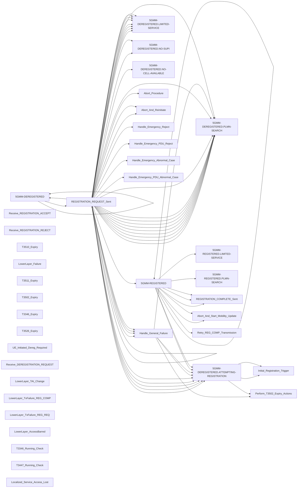

```mermaid
graph LR
    5GMM-DEREGISTERED
    Initial_Registration_Trigger
    REGISTRATION_REQUEST_Sent
    Receive_REGISTRATION_ACCEPT
    5GMM-REGISTERED
    Receive_REGISTRATION_REJECT
    5GMM-DEREGISTERED.ATTEMPTING-REGISTRATION
    T3510_Expiry
    LowerLayer_Failure
    T3511_Expiry
    5GMM-DEREGISTERED.PLMN-SEARCH
    T3502_Expiry
    5GMM-DEREGISTERED.LIMITED-SERVICE
    5GMM-DEREGISTERED.NO-SUPI
    5GMM-DEREGISTERED.NO-CELL-AVAILABLE
    T3346_Expiry
    T3526_Expiry
    UE_Initiated_Dereg_Required
    Receive_DEREGISTRATION_REQUEST
    LowerLayer_TAI_Change
    LowerLayer_TxFailure_REG_COMP
    LowerLayer_TxFailure_REG_REQ
    LowerLayer_AccessBarred
    T3346_Running_Check
    T3447_Running_Check
    Localized_Service_Access_Lost
    5GMM-REGISTERED.LIMITED-SERVICE
    5GMM-REGISTERED.PLMN-SEARCH
    5GMM-DEREGISTERED --> REGISTRATION_REQUEST_Sent
    REGISTRATION_REQUEST_Sent --> 5GMM-REGISTERED
    REGISTRATION_REQUEST_Sent --> 5GMM-DEREGISTERED.NO-SUPI
    REGISTRATION_REQUEST_Sent --> 5GMM-DEREGISTERED.PLMN-SEARCH
    REGISTRATION_REQUEST_Sent --> 5GMM-DEREGISTERED.LIMITED-SERVICE
    REGISTRATION_REQUEST_Sent --> 5GMM-DEREGISTERED.LIMITED-SERVICE
    REGISTRATION_REQUEST_Sent --> 5GMM-DEREGISTERED.PLMN-SEARCH
    REGISTRATION_REQUEST_Sent --> 5GMM-DEREGISTERED.LIMITED-SERVICE
    REGISTRATION_REQUEST_Sent --> 5GMM-DEREGISTERED.ATTEMPTING-REGISTRATION
    REGISTRATION_REQUEST_Sent --> 5GMM-DEREGISTERED.PLMN-SEARCH
    REGISTRATION_REQUEST_Sent --> 5GMM-DEREGISTERED.LIMITED-SERVICE
    REGISTRATION_REQUEST_Sent --> 5GMM-DEREGISTERED.NO-CELL-AVAILABLE
    REGISTRATION_REQUEST_Sent --> 5GMM-DEREGISTERED.ATTEMPTING-REGISTRATION
    REGISTRATION_REQUEST_Sent --> 5GMM-DEREGISTERED.LIMITED-SERVICE
    REGISTRATION_REQUEST_Sent --> 5GMM-DEREGISTERED.PLMN-SEARCH
    REGISTRATION_REQUEST_Sent --> 5GMM-DEREGISTERED
    REGISTRATION_REQUEST_Sent --> 5GMM-DEREGISTERED.PLMN-SEARCH
    REGISTRATION_REQUEST_Sent --> 5GMM-DEREGISTERED.PLMN-SEARCH
    REGISTRATION_REQUEST_Sent --> 5GMM-DEREGISTERED.PLMN-SEARCH
    REGISTRATION_REQUEST_Sent --> 5GMM-DEREGISTERED.LIMITED-SERVICE
    REGISTRATION_REQUEST_Sent --> 5GMM-DEREGISTERED.PLMN-SEARCH
    REGISTRATION_REQUEST_Sent --> 5GMM-DEREGISTERED.LIMITED-SERVICE
    REGISTRATION_REQUEST_Sent --> 5GMM-DEREGISTERED.PLMN-SEARCH
    REGISTRATION_REQUEST_Sent --> 5GMM-DEREGISTERED.PLMN-SEARCH
    REGISTRATION_REQUEST_Sent --> 5GMM-DEREGISTERED.ATTEMPTING-REGISTRATION
    REGISTRATION_REQUEST_Sent --> 5GMM-DEREGISTERED.PLMN-SEARCH
    REGISTRATION_REQUEST_Sent --> 5GMM-DEREGISTERED.ATTEMPTING-REGISTRATION
    REGISTRATION_REQUEST_Sent --> 5GMM-DEREGISTERED.ATTEMPTING-REGISTRATION
    REGISTRATION_REQUEST_Sent --> 5GMM-DEREGISTERED.NO-SUPI
    REGISTRATION_REQUEST_Sent --> Handle_General_Failure
    REGISTRATION_REQUEST_Sent --> Handle_General_Failure
    REGISTRATION_REQUEST_Sent --> Handle_General_Failure
    Handle_General_Failure --> 5GMM-DEREGISTERED.ATTEMPTING-REGISTRATION
    Handle_General_Failure --> 5GMM-DEREGISTERED.ATTEMPTING-REGISTRATION
    Handle_General_Failure --> 5GMM-DEREGISTERED.PLMN-SEARCH
    Handle_General_Failure --> Perform_T3502_Expiry_Actions
    5GMM-DEREGISTERED.ATTEMPTING-REGISTRATION --> Initial_Registration_Trigger
    5GMM-DEREGISTERED.ATTEMPTING-REGISTRATION --> Initial_Registration_Trigger
    5GMM-DEREGISTERED.ATTEMPTING-REGISTRATION --> Perform_T3502_Expiry_Actions
    5GMM-REGISTERED --> REGISTRATION_COMPLETE_Sent
    5GMM-REGISTERED --> 5GMM-REGISTERED.LIMITED-SERVICE
    5GMM-REGISTERED --> 5GMM-REGISTERED.PLMN-SEARCH
    5GMM-REGISTERED --> 5GMM-DEREGISTERED.ATTEMPTING-REGISTRATION
    5GMM-REGISTERED --> 5GMM-DEREGISTERED.ATTEMPTING-REGISTRATION
    5GMM-REGISTERED --> 5GMM-REGISTERED
    5GMM-REGISTERED --> 5GMM-REGISTERED
    5GMM-REGISTERED --> 5GMM-REGISTERED
    REGISTRATION_REQUEST_Sent --> Abort_Procedure
    REGISTRATION_REQUEST_Sent --> REGISTRATION_REQUEST_Sent
    REGISTRATION_REQUEST_Sent --> Abort_And_Reinitiate
    5GMM-REGISTERED --> REGISTRATION_COMPLETE_Sent
    5GMM-REGISTERED --> Abort_And_Start_Mobility_Update
    5GMM-REGISTERED --> REGISTRATION_COMPLETE_Sent
    5GMM-REGISTERED --> Abort_And_Start_Mobility_Update
    5GMM-REGISTERED --> Retry_REG_COMP_Transmission
    REGISTRATION_REQUEST_Sent --> Abort_And_Reinitiate
    5GMM-DEREGISTERED --> 5GMM-DEREGISTERED
    5GMM-DEREGISTERED --> 5GMM-DEREGISTERED
    REGISTRATION_REQUEST_Sent --> Handle_General_Failure
    5GMM-DEREGISTERED --> 5GMM-DEREGISTERED
    REGISTRATION_REQUEST_Sent --> 5GMM-DEREGISTERED.LIMITED-SERVICE
    REGISTRATION_REQUEST_Sent --> 5GMM-DEREGISTERED.PLMN-SEARCH
    5GMM-REGISTERED --> 5GMM-REGISTERED
    REGISTRATION_REQUEST_Sent --> Handle_Emergency_Reject
    REGISTRATION_REQUEST_Sent --> Handle_Emergency_PDU_Reject
    REGISTRATION_REQUEST_Sent --> Handle_Emergency_Abnormal_Case
    REGISTRATION_REQUEST_Sent --> Handle_Emergency_PDU_Abnormal_Case
```