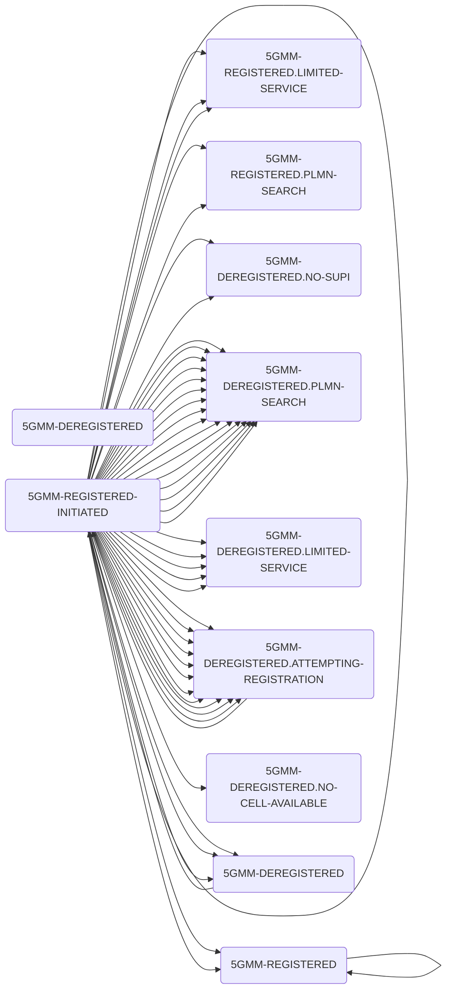

```mermaid
graph LR
    classDef state fill:#f9f,stroke:#333,stroke-width:2px;
    classDef event fill:#bbf,stroke:#333,stroke-width:2px;

    node1("5GMM-DEREGISTERED")
    node2("5GMM-REGISTERED-INITIATED")
    node3("5GMM-REGISTERED")
    node4("5GMM-REGISTERED.LIMITED-SERVICE")
    node5("5GMM-REGISTERED.PLMN-SEARCH")
    node6("5GMM-DEREGISTERED.NO-SUPI")
    node7("5GMM-DEREGISTERED.PLMN-SEARCH")
    node8("5GMM-DEREGISTERED.LIMITED-SERVICE")
    node9("5GMM-DEREGISTERED.ATTEMPTING-REGISTRATION")
    node10("5GMM-DEREGISTERED.NO-CELL-AVAILABLE")
    node11("5GMM-DEREGISTERED")
    node11 --> node2
    node2 --> node3
    node2 --> node3
    node2 --> node4
    node2 --> node5
    node2 --> node4
    node2 --> node5
    node2 --> node4
    node2 --> node6
    node2 --> node7
    node2 --> node8
    node2 --> node8
    node2 --> node7
    node2 --> node9
    node2 --> node8
    node2 --> node10
    node2 --> node7
    node2 --> node9
    node2 --> node7
    node2 --> node11
    node2 --> node7
    node2 --> node7
    node2 --> node8
    node2 --> node7
    node2 --> node11
    node2 --> node7
    node2 --> node9
    node2 --> node7
    node2 --> node7
    node2 --> node9
    node2 --> node7
    node2 --> node9
    node2 --> node7
    node2 --> node6
    node2 --> node9
    node2 --> node9
    node2 --> node7
    node9 --> node2
    node2 --> node9
    node2 --> node9
    node2 --> node7
    node2 --> node2
    node3 --> node3
    node2 --> node2
    node2 --> node8
    node2 --> node7
    node2 --> node9
    node2 --> node9
    node2 --> node7
    node2 --> node11
```