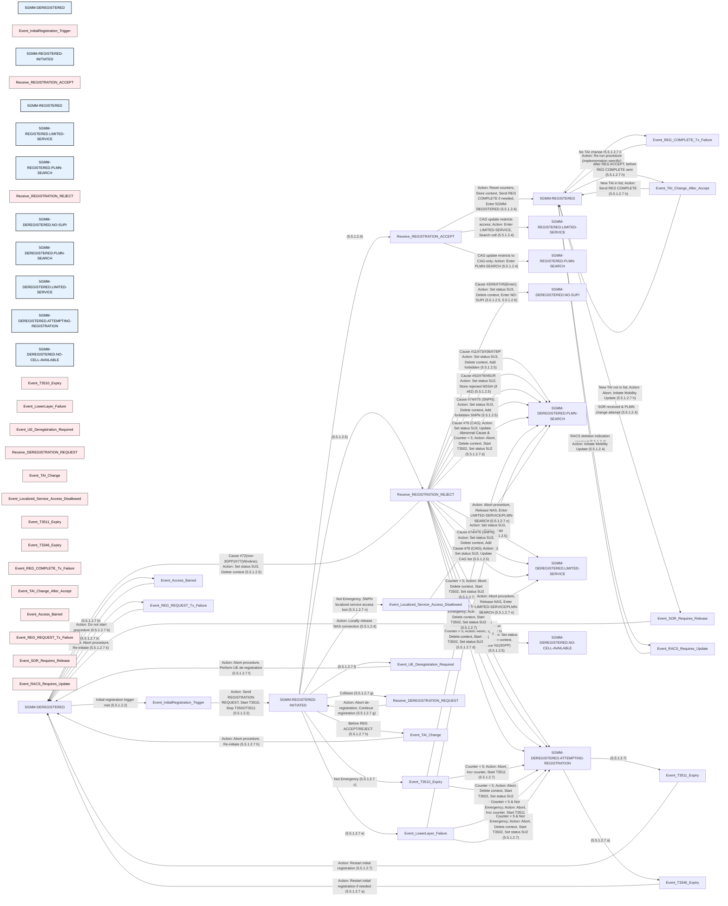

# Registration procedure for initial registration

```mermaid
graph LR
    classDef state fill:#e6f3ff,stroke:#333,stroke-width:2px,color:#000;
    classDef event fill:#ffebee,stroke:#333,stroke-width:1px,color:#000;

    node1["5GMM-DEREGISTERED"]
    class node1 state
    node2["Event_InitialRegistration_Trigger"]
    class node2 event
    node3["5GMM-REGISTERED-INITIATED"]
    class node3 state
    node4["Receive_REGISTRATION_ACCEPT"]
    class node4 event
    node5["5GMM-REGISTERED"]
    class node5 state
    node6["5GMM-REGISTERED.LIMITED-SERVICE"]
    class node6 state
    node7["5GMM-REGISTERED.PLMN-SEARCH"]
    class node7 state
    node8["Receive_REGISTRATION_REJECT"]
    class node8 event
    node9["5GMM-DEREGISTERED.NO-SUPI"]
    class node9 state
    node10["5GMM-DEREGISTERED.PLMN-SEARCH"]
    class node10 state
    node11["5GMM-DEREGISTERED.LIMITED-SERVICE"]
    class node11 state
    node12["5GMM-DEREGISTERED.ATTEMPTING-REGISTRATION"]
    class node12 state
    node13["5GMM-DEREGISTERED.NO-CELL-AVAILABLE"]
    class node13 state
    node14["Event_T3510_Expiry"]
    class node14 event
    node15["Event_LowerLayer_Failure"]
    class node15 event
    node16["Event_UE_Deregistration_Required"]
    class node16 event
    node17["Receive_DEREGISTRATION_REQUEST"]
    class node17 event
    node18["Event_TAI_Change"]
    class node18 event
    node19["Event_Localized_Service_Access_Disallowed"]
    class node19 event
    node20["Event_T3511_Expiry"]
    class node20 event
    node21["Event_T3346_Expiry"]
    class node21 event
    node22["Event_REG_COMPLETE_Tx_Failure"]
    class node22 event
    node23["Event_TAI_Change_After_Accept"]
    class node23 event
    node24["Event_Access_Barred"]
    class node24 event
    node25["Event_REG_REQUEST_Tx_Failure"]
    class node25 event
    node26["Event_SOR_Requires_Release"]
    class node26 event
    node27["Event_RACS_Requires_Update"]
    class node27 event
    5GMM-DEREGISTERED -->|"Initial registration trigger met (5.5.1.2.2)"| Event_InitialRegistration_Trigger
    Event_InitialRegistration_Trigger -->|"Action: Send REGISTRATION REQUEST, Start T3510, Stop T3502/T3511 (5.5.1.2.2)"| 5GMM-REGISTERED-INITIATED
    5GMM-REGISTERED-INITIATED -->|" (5.5.1.2.4)"| Receive_REGISTRATION_ACCEPT
    Receive_REGISTRATION_ACCEPT -->|"Action: Reset counters, Store context, Send REG COMPLETE if needed, Enter 5GMM-REGISTERED (5.5.1.2.4)"| 5GMM-REGISTERED
    Receive_REGISTRATION_ACCEPT -->|"CAG update restricts access; Action: Enter LIMITED-SERVICE, Search cell (5.5.1.2.4)"| 5GMM-REGISTERED.LIMITED-SERVICE
    Receive_REGISTRATION_ACCEPT -->|"CAG update restricts to CAG-only; Action: Enter PLMN-SEARCH (5.5.1.2.4)"| 5GMM-REGISTERED.PLMN-SEARCH
    5GMM-REGISTERED-INITIATED -->|" (5.5.1.2.5)"| Receive_REGISTRATION_REJECT
    Receive_REGISTRATION_REJECT -->|"Cause #3/#6/#7/#5(Emer); Action: Set status 5U3, Delete context, Enter NO-SUPI (5.5.1.2.5, 5.5.1.2.6)"| 5GMM-DEREGISTERED.NO-SUPI
    Receive_REGISTRATION_REJECT -->|"Cause #11/#73/#36/#78/#80; Action: Set status 5U3, Delete context, Add forbidden (5.5.1.2.5)"| 5GMM-DEREGISTERED.PLMN-SEARCH
    Receive_REGISTRATION_REJECT -->|"Cause #12/#13/#15/#27; Action: Set status 5U3, Delete TAI list, Add forbidden TAI (5.5.1.2.5)"| 5GMM-DEREGISTERED.LIMITED-SERVICE
    Receive_REGISTRATION_REJECT -->|"Cause #22; Action: Set status 5U2, Start T3346 (5.5.1.2.5)"| 5GMM-DEREGISTERED.ATTEMPTING-REGISTRATION
    Receive_REGISTRATION_REJECT -->|"Cause #31; Action: Set status 5U3, Delete context, Disable N1(3GPP) (5.5.1.2.5)"| 5GMM-DEREGISTERED.NO-CELL-AVAILABLE
    Receive_REGISTRATION_REJECT -->|"Cause #62/#79/#81/#82; Action: Set status 5U2, Store rejected NSSAI (if #62) (5.5.1.2.5)"| 5GMM-DEREGISTERED.ATTEMPTING-REGISTRATION
    Receive_REGISTRATION_REJECT -->|"Cause #62/#79/#81/#82; Action: Set status 5U2, Store rejected NSSAI (if #62) (5.5.1.2.5)"| 5GMM-DEREGISTERED.PLMN-SEARCH
    Receive_REGISTRATION_REJECT -->|"Cause #72(non-3GPP)/#77(Wireline); Action: Set status 5U3, Delete context (5.5.1.2.5)"| 5GMM-DEREGISTERED
    Receive_REGISTRATION_REJECT -->|"Cause #74/#75 (SNPN); Action: Set status 5U3, Delete context, Add forbidden SNPN (5.5.1.2.5)"| 5GMM-DEREGISTERED.PLMN-SEARCH
    Receive_REGISTRATION_REJECT -->|"Cause #74/#75 (SNPN); Action: Set status 5U3, Delete context, Add forbidden SNPN (5.5.1.2.5)"| 5GMM-DEREGISTERED.LIMITED-SERVICE
    Receive_REGISTRATION_REJECT -->|"Cause #76 (CAG); Action: Set status 5U3, Update CAG list (5.5.1.2.5)"| 5GMM-DEREGISTERED.PLMN-SEARCH
    Receive_REGISTRATION_REJECT -->|"Cause #76 (CAG); Action: Set status 5U3, Update CAG list (5.5.1.2.5)"| 5GMM-DEREGISTERED.LIMITED-SERVICE
    Receive_REGISTRATION_REJECT -->|"Abnormal Cause & Counter < 5; Action: Abort, Incr counter, Start T3511 (5.5.1.2.7 d)"| 5GMM-DEREGISTERED.ATTEMPTING-REGISTRATION
    Receive_REGISTRATION_REJECT -->|"Abnormal Cause & Counter = 5; Action: Abort, Delete context, Start T3502, Set status 5U2 (5.5.1.2.7 d)"| 5GMM-DEREGISTERED.ATTEMPTING-REGISTRATION
    Receive_REGISTRATION_REJECT -->|"Abnormal Cause & Counter = 5; Action: Abort, Delete context, Start T3502, Set status 5U2 (5.5.1.2.7 d)"| 5GMM-DEREGISTERED.PLMN-SEARCH
    5GMM-REGISTERED-INITIATED -->|"Not Emergency (5.5.1.2.7 c)"| Event_T3510_Expiry
    Event_T3510_Expiry -->|"Counter < 5; Action: Abort, Incr counter, Start T3511 (5.5.1.2.7)"| 5GMM-DEREGISTERED.ATTEMPTING-REGISTRATION
    Event_T3510_Expiry -->|"Counter = 5; Action: Abort, Delete context, Start T3502, Set status 5U2 (5.5.1.2.7)"| 5GMM-DEREGISTERED.ATTEMPTING-REGISTRATION
    Event_T3510_Expiry -->|"Counter = 5; Action: Abort, Delete context, Start T3502, Set status 5U2 (5.5.1.2.7)"| 5GMM-DEREGISTERED.PLMN-SEARCH
    5GMM-REGISTERED-INITIATED -->|" (5.5.1.2.7 e)"| Event_LowerLayer_Failure
    Event_LowerLayer_Failure -->|"Counter < 5 & Not Emergency; Action: Abort, Incr counter, Start T3511 (5.5.1.2.7)"| 5GMM-DEREGISTERED.ATTEMPTING-REGISTRATION
    Event_LowerLayer_Failure -->|"Counter = 5 & Not Emergency; Action: Abort, Delete context, Start T3502, Set status 5U2 (5.5.1.2.7)"| 5GMM-DEREGISTERED.ATTEMPTING-REGISTRATION
    Event_LowerLayer_Failure -->|"Counter = 5 & Not Emergency; Action: Abort, Delete context, Start T3502, Set status 5U2 (5.5.1.2.7)"| 5GMM-DEREGISTERED.PLMN-SEARCH
    5GMM-REGISTERED-INITIATED -->|" (5.5.1.2.7 f)"| Event_UE_Deregistration_Required
    Event_UE_Deregistration_Required -->|"Action: Abort procedure, Perform UE de-registration (5.5.1.2.7 f)"| 5GMM-DEREGISTERED
    5GMM-REGISTERED-INITIATED -->|"Collision (5.5.1.2.7 g)"| Receive_DEREGISTRATION_REQUEST
    Receive_DEREGISTRATION_REQUEST -->|"Action: Abort de-registration, Continue registration (5.5.1.2.7 g)"| 5GMM-REGISTERED-INITIATED
    5GMM-REGISTERED-INITIATED -->|"Before REG ACCEPT/REJECT (5.5.1.2.7 h)"| Event_TAI_Change
    Event_TAI_Change -->|"Action: Abort procedure, Re-initiate (5.5.1.2.7 h)"| 5GMM-DEREGISTERED
    5GMM-REGISTERED-INITIATED -->|"Not Emergency, SNPN localized service access lost (5.5.1.2.7 n)"| Event_Localized_Service_Access_Disallowed
    Event_Localized_Service_Access_Disallowed -->|"Action: Abort procedure, Release NAS, Enter LIMITED-SERVICE/PLMN-SEARCH (5.5.1.2.7 n)"| 5GMM-DEREGISTERED.LIMITED-SERVICE
    Event_Localized_Service_Access_Disallowed -->|"Action: Abort procedure, Release NAS, Enter LIMITED-SERVICE/PLMN-SEARCH (5.5.1.2.7 n)"| 5GMM-DEREGISTERED.PLMN-SEARCH
    5GMM-DEREGISTERED.ATTEMPTING-REGISTRATION -->|" (5.5.1.2.7)"| Event_T3511_Expiry
    Event_T3511_Expiry -->|"Action: Restart initial registration (5.5.1.2.7)"| 5GMM-DEREGISTERED
    5GMM-DEREGISTERED.ATTEMPTING-REGISTRATION -->|" (5.5.1.2.7 a)"| Event_T3346_Expiry
    Event_T3346_Expiry -->|"Action: Restart initial registration if needed (5.5.1.2.7 a)"| 5GMM-DEREGISTERED
    5GMM-REGISTERED -->|"No TAI change (5.5.1.2.7 j)"| Event_REG_COMPLETE_Tx_Failure
    Event_REG_COMPLETE_Tx_Failure -->|"Action: Re-run procedure (implementation specific) (5.5.1.2.7 j)"| 5GMM-REGISTERED
    5GMM-REGISTERED -->|"After REG ACCEPT, before REG COMPLETE sent (5.5.1.2.7 h)"| Event_TAI_Change_After_Accept
    Event_TAI_Change_After_Accept -->|"New TAI in list; Action: Send REG COMPLETE (5.5.1.2.7 h)"| 5GMM-REGISTERED
    Event_TAI_Change_After_Accept -->|"New TAI not in list; Action: Abort, Initiate Mobility Update (5.5.1.2.7 h)"| 5GMM-REGISTERED
    5GMM-DEREGISTERED -->|" (5.5.1.2.7 b)"| Event_Access_Barred
    Event_Access_Barred -->|"Action: Do not start procedure (5.5.1.2.7 b)"| 5GMM-DEREGISTERED
    5GMM-DEREGISTERED -->|" (5.5.1.2.7 k)"| Event_REG_REQUEST_Tx_Failure
    Event_REG_REQUEST_Tx_Failure -->|"Action: Abort procedure, Re-initiate (5.5.1.2.7 k)"| 5GMM-DEREGISTERED
    5GMM-REGISTERED -->|"SOR received & PLMN change attempt (5.5.1.2.4)"| Event_SOR_Requires_Release
    Event_SOR_Requires_Release -->|"Action: Locally release NAS connection (5.5.1.2.4)"| 5GMM-DEREGISTERED
    5GMM-REGISTERED -->|"RACS deletion indication received (5.5.1.2.4)"| Event_RACS_Requires_Update
    Event_RACS_Requires_Update -->|"Action: Initiate Mobility Update (5.5.1.2.4)"| 5GMM-REGISTERED
```