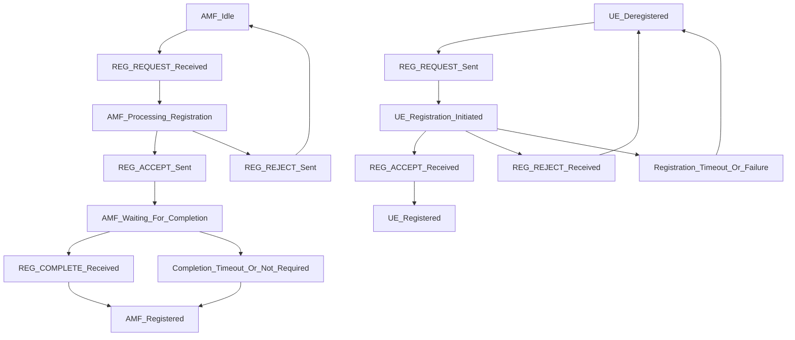

```mermaid
graph TD;
  UE_Deregistered;
  UE_Registration_Initiated;
  UE_Registered;
  AMF_Idle;
  AMF_Processing_Registration;
  AMF_Waiting_For_Completion;
  AMF_Registered;
  REG_REQUEST_Sent;
  REG_REQUEST_Received;
  REG_ACCEPT_Sent;
  REG_ACCEPT_Received;
  REG_COMPLETE_Received;
  Completion_Timeout_Or_Not_Required;
  REG_REJECT_Sent;
  REG_REJECT_Received;
  Registration_Timeout_Or_Failure;
  UE_Deregistered --> REG_REQUEST_Sent;
  REG_REQUEST_Sent --> UE_Registration_Initiated;
  AMF_Idle --> REG_REQUEST_Received;
  REG_REQUEST_Received --> AMF_Processing_Registration;
  AMF_Processing_Registration --> REG_ACCEPT_Sent;
  REG_ACCEPT_Sent --> AMF_Waiting_For_Completion;
  UE_Registration_Initiated --> REG_ACCEPT_Received;
  REG_ACCEPT_Received --> UE_Registered;
  AMF_Waiting_For_Completion --> REG_COMPLETE_Received;
  REG_COMPLETE_Received --> AMF_Registered;
  AMF_Waiting_For_Completion --> Completion_Timeout_Or_Not_Required;
  Completion_Timeout_Or_Not_Required --> AMF_Registered;
  AMF_Processing_Registration --> REG_REJECT_Sent;
  REG_REJECT_Sent --> AMF_Idle;
  UE_Registration_Initiated --> REG_REJECT_Received;
  REG_REJECT_Received --> UE_Deregistered;
  UE_Registration_Initiated --> Registration_Timeout_Or_Failure;
  Registration_Timeout_Or_Failure --> UE_Deregistered;
```
