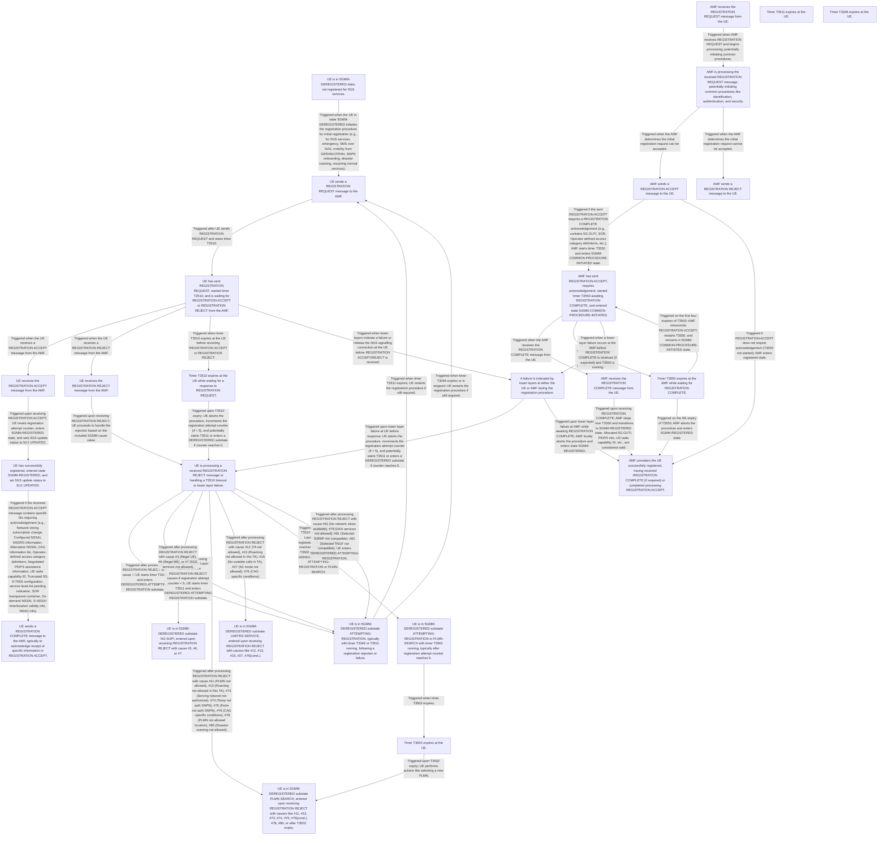

```mermaid
graph TD;
  UE_5GMM_DEREGISTERED["UE is in 5GMM-DEREGISTERED state, not registered for 5GS services."];
  Send_REGISTRATION_REQUEST["UE sends a REGISTRATION REQUEST message to the AMF."];
  UE_Awaiting_AMF_Response["UE has sent REGISTRATION REQUEST, started timer T3510, and is waiting for REGISTRATION ACCEPT or REGISTRATION REJECT from the AMF."];
  Receive_REGISTRATION_REQUEST["AMF receives the REGISTRATION REQUEST message from the UE."];
  AMF_Processing_Registration["AMF is processing the received REGISTRATION REQUEST message, potentially initiating common procedures like identification, authentication, and security."];
  Send_REGISTRATION_ACCEPT["AMF sends a REGISTRATION ACCEPT message to the UE."];
  AMF_5GMM_COMMON_PROCEDURE_INITIATED["AMF has sent REGISTRATION ACCEPT, requires acknowledgement, started timer T3550 awaiting REGISTRATION COMPLETE, and entered state 5GMM-COMMON-PROCEDURE-INITIATED."];
  Receive_REGISTRATION_ACCEPT["UE receives the REGISTRATION ACCEPT message from the AMF."];
  UE_5GMM_REGISTERED["UE has successfully registered, entered state 5GMM-REGISTERED, and set 5GS update status to 5U1 UPDATED."];
  Send_REGISTRATION_COMPLETE["UE sends a REGISTRATION COMPLETE message to the AMF, typically to acknowledge receipt of specific information in REGISTRATION ACCEPT."];
  Receive_REGISTRATION_COMPLETE["AMF receives the REGISTRATION COMPLETE message from the UE."];
  AMF_5GMM_REGISTERED["AMF considers the UE successfully registered, having received REGISTRATION COMPLETE (if required) or completed processing REGISTRATION ACCEPT."];
  Send_REGISTRATION_REJECT["AMF sends a REGISTRATION REJECT message to the UE."];
  Receive_REGISTRATION_REJECT["UE receives the REGISTRATION REJECT message from the AMF."];
  UE_Processing_Rejection["UE is processing a received REGISTRATION REJECT message or handling a T3510 timeout or lower layer failure."];
  T3510_Timeout["Timer T3510 expires at the UE while waiting for a response to REGISTRATION REQUEST."];
  T3550_Timeout["Timer T3550 expires at the AMF while waiting for REGISTRATION COMPLETE."];
  Lower_Layer_Failure["A failure is indicated by lower layers at either the UE or AMF during the registration procedure."];
  UE_DEREGISTERED_ATTEMPTING_REGISTRATION["UE is in 5GMM-DEREGISTERED substate ATTEMPTING-REGISTRATION, typically with timer T3346 or T3511 running, following a registration rejection or failure."];
  T3511_Expiry["Timer T3511 expires at the UE."];
  T3346_Expiry["Timer T3346 expires at the UE."];
  UE_5GMM_DEREGISTERED_NO_SUPI["UE is in 5GMM-DEREGISTERED substate NO-SUPI, entered upon receiving REGISTRATION REJECT with cause #3, #6, or #7."];
  UE_5GMM_DEREGISTERED_PLMN_SEARCH["UE is in 5GMM-DEREGISTERED substate PLMN-SEARCH, entered upon receiving REGISTRATION REJECT with causes like #11, #13, #73, #74, #75, #76(cond.), #78, #80, or after T3502 expiry."];
  UE_5GMM_DEREGISTERED_LIMITED_SERVICE["UE is in 5GMM-DEREGISTERED substate LIMITED-SERVICE, entered upon receiving REGISTRATION REJECT with causes like #12, #13, #15, #27, #76(cond.)."];
  UE_5GMM_DEREGISTERED_T3502_RUNNING["UE is in 5GMM-DEREGISTERED substate ATTEMPTING-REGISTRATION or PLMN-SEARCH with timer T3502 running, typically after registration attempt counter reaches 5."];
  T3502_Expiry["Timer T3502 expires at the UE."];
  UE_5GMM_DEREGISTERED -->|"Triggered when the UE in state 5GMM-DEREGISTERED initiates the registration procedure for initial registration (e.g., for 5GS services, emergency, SMS over NAS, mobility from GERAN/UTRAN, SNPN onboarding, disaster roaming, resuming normal services)."| Send_REGISTRATION_REQUEST;
  Send_REGISTRATION_REQUEST -->|"Triggered after UE sends REGISTRATION REQUEST and starts timer T3510."| UE_Awaiting_AMF_Response;
  Receive_REGISTRATION_REQUEST -->|"Triggered when AMF receives REGISTRATION REQUEST and begins processing, potentially initiating common procedures."| AMF_Processing_Registration;
  AMF_Processing_Registration -->|"Triggered when the AMF determines the initial registration request can be accepted."| Send_REGISTRATION_ACCEPT;
  Send_REGISTRATION_ACCEPT -->|"Triggered if the sent REGISTRATION ACCEPT requires a REGISTRATION COMPLETE acknowledgement (e.g., contains 5G-GUTI, SOR, Operator-defined access category definitions, etc.); AMF starts timer T3550 and enters 5GMM-COMMON-PROCEDURE-INITIATED state."| AMF_5GMM_COMMON_PROCEDURE_INITIATED;
  UE_Awaiting_AMF_Response -->|"Triggered when the UE receives a REGISTRATION ACCEPT message from the AMF."| Receive_REGISTRATION_ACCEPT;
  Receive_REGISTRATION_ACCEPT -->|"Triggered upon receiving REGISTRATION ACCEPT; UE resets registration attempt counter, enters 5GMM-REGISTERED state, and sets 5GS update status to 5U1 UPDATED."| UE_5GMM_REGISTERED;
  UE_5GMM_REGISTERED -->|"Triggered if the received REGISTRATION ACCEPT message contains specific IEs requiring acknowledgement (e.g., Network slicing subscription change, Configured NSSAI, NSSRG information, Alternative NSSAI, CAG information list, Operator-defined access category definitions, Negotiated PEIPS assistance information, UE radio capability ID, Truncated 5G-S-TMSI configuration, service-level-AA pending indication, SOR transparent container, On-demand NSSAI, S-NSSAI time/location validity info, NSAG info)."| Send_REGISTRATION_COMPLETE;
  AMF_5GMM_COMMON_PROCEDURE_INITIATED -->|"Triggered when the AMF receives the REGISTRATION COMPLETE message from the UE."| Receive_REGISTRATION_COMPLETE;
  Receive_REGISTRATION_COMPLETE -->|"Triggered upon receiving REGISTRATION COMPLETE; AMF stops timer T3550 and transitions to 5GMM-REGISTERED state. Allocated 5G-GUTI, PEIPS info, UE radio capability ID, etc., are considered valid."| AMF_5GMM_REGISTERED;
  AMF_Processing_Registration -->|"Triggered when the AMF determines the initial registration request cannot be accepted."| Send_REGISTRATION_REJECT;
  UE_Awaiting_AMF_Response -->|"Triggered when the UE receives a REGISTRATION REJECT message from the AMF."| Receive_REGISTRATION_REJECT;
  Receive_REGISTRATION_REJECT -->|"Triggered upon receiving REGISTRATION REJECT; UE proceeds to handle the rejection based on the included 5GMM cause value."| UE_Processing_Rejection;
  UE_Awaiting_AMF_Response -->|"Triggered when timer T3510 expires at the UE before receiving REGISTRATION ACCEPT or REGISTRATION REJECT."| T3510_Timeout;
  T3510_Timeout -->|"Triggered upon T3510 expiry; UE aborts the procedure, increments the registration attempt counter (if < 5), and potentially starts T3511 or enters a DEREGISTERED substate if counter reaches 5."| UE_Processing_Rejection;
  AMF_5GMM_COMMON_PROCEDURE_INITIATED -->|"Triggered when timer T3550 expires at the AMF before receiving REGISTRATION COMPLETE (if expected)."| T3550_Timeout;
  T3550_Timeout -->|"Triggered on the first four expiries of T3550; AMF retransmits REGISTRATION ACCEPT, restarts T3550, and remains in 5GMM-COMMON-PROCEDURE-INITIATED state."| AMF_5GMM_COMMON_PROCEDURE_INITIATED;
  UE_Awaiting_AMF_Response -->|"Triggered when lower layers indicate a failure or release the NAS signalling connection at the UE before REGISTRATION ACCEPT/REJECT is received."| Lower_Layer_Failure;
  Lower_Layer_Failure -->|"Triggered upon lower layer failure at UE before response; UE aborts the procedure, increments the registration attempt counter (if < 5), and potentially starts T3511 or enters a DEREGISTERED substate if counter reaches 5."| UE_Processing_Rejection;
  AMF_5GMM_COMMON_PROCEDURE_INITIATED -->|"Triggered when a lower layer failure occurs at the AMF before REGISTRATION COMPLETE is received (if expected) and T3550 is running."| Lower_Layer_Failure;
  Lower_Layer_Failure -->|"Triggered upon lower layer failure at AMF while awaiting REGISTRATION COMPLETE; AMF locally aborts the procedure and enters state 5GMM-REGISTERED."| AMF_5GMM_REGISTERED;
  Send_REGISTRATION_ACCEPT -->|"Triggered if REGISTRATION ACCEPT does not require acknowledgement (T3550 not started); AMF enters registered state."| AMF_5GMM_REGISTERED;
  T3550_Timeout -->|"Triggered on the 5th expiry of T3550; AMF aborts the procedure and enters 5GMM-REGISTERED state."| AMF_5GMM_REGISTERED;
  UE_Processing_Rejection -->|"Triggered after processing REGISTRATION REJECT with cause #22; UE starts timer T3346 and enters DEREGISTERED.ATTEMPTING-REGISTRATION substate."| UE_DEREGISTERED_ATTEMPTING_REGISTRATION;
  UE_Processing_Rejection -->|"Triggered after processing T3510 timeout, Lower Layer Failure, or certain REGISTRATION REJECT causes if registration attempt counter < 5; UE starts timer T3511 and enters DEREGISTERED.ATTEMPTING-REGISTRATION substate."| UE_DEREGISTERED_ATTEMPTING_REGISTRATION;
  UE_DEREGISTERED_ATTEMPTING_REGISTRATION -->|"Triggered when timer T3511 expires; UE restarts the registration procedure if still required."| Send_REGISTRATION_REQUEST;
  UE_DEREGISTERED_ATTEMPTING_REGISTRATION -->|"Triggered when timer T3346 expires or is stopped; UE restarts the registration procedure if still required."| Send_REGISTRATION_REQUEST;
  UE_Processing_Rejection -->|"Triggered after processing REGISTRATION REJECT with cause #3 (Illegal UE), #6 (Illegal ME), or #7 (5GS services not allowed)."| UE_5GMM_DEREGISTERED_NO_SUPI;
  UE_Processing_Rejection -->|"Triggered after processing REGISTRATION REJECT with cause #11 (PLMN not allowed), #13 (Roaming not allowed in this TA), #73 (Serving network not authorized), #74 (Temp not auth SNPN), #75 (Perm not auth SNPN), #76 (CAG - specific conditions), #78 (PLMN not allowed location), #80 (Disaster roaming not allowed)."| UE_5GMM_DEREGISTERED_PLMN_SEARCH;
  UE_Processing_Rejection -->|"Triggered after processing REGISTRATION REJECT with cause #12 (TA not allowed), #13 (Roaming not allowed in this TA), #15 (No suitable cells in TA), #27 (N1 mode not allowed), #76 (CAG - specific conditions)."| UE_5GMM_DEREGISTERED_LIMITED_SERVICE;
  UE_Processing_Rejection -->|"Triggered after processing T3510 timeout or Lower Layer Failure when registration attempt counter reaches 5; UE starts timer T3502 and enters 5GMM-DEREGISTERED substate ATTEMPTING-REGISTRATION or PLMN-SEARCH."| UE_5GMM_DEREGISTERED_T3502_RUNNING;
  UE_Processing_Rejection -->|"Triggered after processing REGISTRATION REJECT with cause #62 (No network slices available), #79 (UAS services not allowed), #81 (Selected N3IWF not compatible), #82 (Selected TNGF not compatible). UE enters DEREGISTERED.ATTEMPTING-REGISTRATION."| UE_DEREGISTERED_ATTEMPTING_REGISTRATION;
  UE_5GMM_DEREGISTERED_T3502_RUNNING -->|"Triggered when timer T3502 expires."| T3502_Expiry;
  T3502_Expiry -->|"Triggered upon T3502 expiry; UE performs actions like selecting a new PLMN."| UE_5GMM_DEREGISTERED_PLMN_SEARCH;
```
