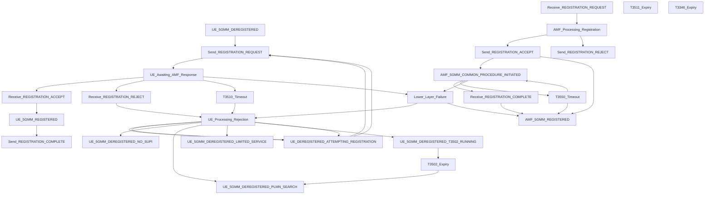

```mermaid
graph TD;
  UE_5GMM_DEREGISTERED;
  Send_REGISTRATION_REQUEST;
  UE_Awaiting_AMF_Response;
  Receive_REGISTRATION_REQUEST;
  AMF_Processing_Registration;
  Send_REGISTRATION_ACCEPT;
  AMF_5GMM_COMMON_PROCEDURE_INITIATED;
  Receive_REGISTRATION_ACCEPT;
  UE_5GMM_REGISTERED;
  Send_REGISTRATION_COMPLETE;
  Receive_REGISTRATION_COMPLETE;
  AMF_5GMM_REGISTERED;
  Send_REGISTRATION_REJECT;
  Receive_REGISTRATION_REJECT;
  UE_Processing_Rejection;
  T3510_Timeout;
  T3550_Timeout;
  Lower_Layer_Failure;
  UE_DEREGISTERED_ATTEMPTING_REGISTRATION;
  T3511_Expiry;
  T3346_Expiry;
  UE_5GMM_DEREGISTERED_NO_SUPI;
  UE_5GMM_DEREGISTERED_PLMN_SEARCH;
  UE_5GMM_DEREGISTERED_LIMITED_SERVICE;
  UE_5GMM_DEREGISTERED_T3502_RUNNING;
  T3502_Expiry;
  UE_5GMM_DEREGISTERED --> Send_REGISTRATION_REQUEST;
  Send_REGISTRATION_REQUEST --> UE_Awaiting_AMF_Response;
  Receive_REGISTRATION_REQUEST --> AMF_Processing_Registration;
  AMF_Processing_Registration --> Send_REGISTRATION_ACCEPT;
  Send_REGISTRATION_ACCEPT --> AMF_5GMM_COMMON_PROCEDURE_INITIATED;
  UE_Awaiting_AMF_Response --> Receive_REGISTRATION_ACCEPT;
  Receive_REGISTRATION_ACCEPT --> UE_5GMM_REGISTERED;
  UE_5GMM_REGISTERED --> Send_REGISTRATION_COMPLETE;
  AMF_5GMM_COMMON_PROCEDURE_INITIATED --> Receive_REGISTRATION_COMPLETE;
  Receive_REGISTRATION_COMPLETE --> AMF_5GMM_REGISTERED;
  AMF_Processing_Registration --> Send_REGISTRATION_REJECT;
  UE_Awaiting_AMF_Response --> Receive_REGISTRATION_REJECT;
  Receive_REGISTRATION_REJECT --> UE_Processing_Rejection;
  UE_Awaiting_AMF_Response --> T3510_Timeout;
  T3510_Timeout --> UE_Processing_Rejection;
  AMF_5GMM_COMMON_PROCEDURE_INITIATED --> T3550_Timeout;
  T3550_Timeout --> AMF_5GMM_COMMON_PROCEDURE_INITIATED;
  UE_Awaiting_AMF_Response --> Lower_Layer_Failure;
  Lower_Layer_Failure --> UE_Processing_Rejection;
  AMF_5GMM_COMMON_PROCEDURE_INITIATED --> Lower_Layer_Failure;
  Lower_Layer_Failure --> AMF_5GMM_REGISTERED;
  Send_REGISTRATION_ACCEPT --> AMF_5GMM_REGISTERED;
  T3550_Timeout --> AMF_5GMM_REGISTERED;
  UE_Processing_Rejection --> UE_DEREGISTERED_ATTEMPTING_REGISTRATION;
  UE_Processing_Rejection --> UE_DEREGISTERED_ATTEMPTING_REGISTRATION;
  UE_DEREGISTERED_ATTEMPTING_REGISTRATION --> Send_REGISTRATION_REQUEST;
  UE_DEREGISTERED_ATTEMPTING_REGISTRATION --> Send_REGISTRATION_REQUEST;
  UE_Processing_Rejection --> UE_5GMM_DEREGISTERED_NO_SUPI;
  UE_Processing_Rejection --> UE_5GMM_DEREGISTERED_PLMN_SEARCH;
  UE_Processing_Rejection --> UE_5GMM_DEREGISTERED_LIMITED_SERVICE;
  UE_Processing_Rejection --> UE_5GMM_DEREGISTERED_T3502_RUNNING;
  UE_Processing_Rejection --> UE_DEREGISTERED_ATTEMPTING_REGISTRATION;
  UE_5GMM_DEREGISTERED_T3502_RUNNING --> T3502_Expiry;
  T3502_Expiry --> UE_5GMM_DEREGISTERED_PLMN_SEARCH;
```
