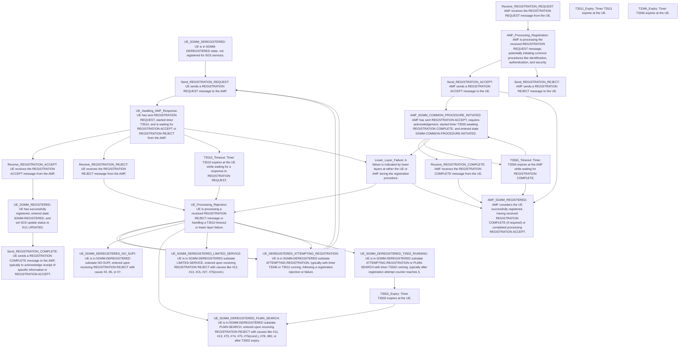

```mermaid
graph TD;
  UE_5GMM_DEREGISTERED["UE_5GMM_DEREGISTERED: UE is in 5GMM-DEREGISTERED state, not registered for 5GS services."];
  Send_REGISTRATION_REQUEST["Send_REGISTRATION_REQUEST: UE sends a REGISTRATION REQUEST message to the AMF."];
  UE_Awaiting_AMF_Response["UE_Awaiting_AMF_Response: UE has sent REGISTRATION REQUEST, started timer T3510, and is waiting for REGISTRATION ACCEPT or REGISTRATION REJECT from the AMF."];
  Receive_REGISTRATION_REQUEST["Receive_REGISTRATION_REQUEST: AMF receives the REGISTRATION REQUEST message from the UE."];
  AMF_Processing_Registration["AMF_Processing_Registration: AMF is processing the received REGISTRATION REQUEST message, potentially initiating common procedures like identification, authentication, and security."];
  Send_REGISTRATION_ACCEPT["Send_REGISTRATION_ACCEPT: AMF sends a REGISTRATION ACCEPT message to the UE."];
  AMF_5GMM_COMMON_PROCEDURE_INITIATED["AMF_5GMM_COMMON_PROCEDURE_INITIATED: AMF has sent REGISTRATION ACCEPT, requires acknowledgement, started timer T3550 awaiting REGISTRATION COMPLETE, and entered state 5GMM-COMMON-PROCEDURE-INITIATED."];
  Receive_REGISTRATION_ACCEPT["Receive_REGISTRATION_ACCEPT: UE receives the REGISTRATION ACCEPT message from the AMF."];
  UE_5GMM_REGISTERED["UE_5GMM_REGISTERED: UE has successfully registered, entered state 5GMM-REGISTERED, and set 5GS update status to 5U1 UPDATED."];
  Send_REGISTRATION_COMPLETE["Send_REGISTRATION_COMPLETE: UE sends a REGISTRATION COMPLETE message to the AMF, typically to acknowledge receipt of specific information in REGISTRATION ACCEPT."];
  Receive_REGISTRATION_COMPLETE["Receive_REGISTRATION_COMPLETE: AMF receives the REGISTRATION COMPLETE message from the UE."];
  AMF_5GMM_REGISTERED["AMF_5GMM_REGISTERED: AMF considers the UE successfully registered, having received REGISTRATION COMPLETE (if required) or completed processing REGISTRATION ACCEPT."];
  Send_REGISTRATION_REJECT["Send_REGISTRATION_REJECT: AMF sends a REGISTRATION REJECT message to the UE."];
  Receive_REGISTRATION_REJECT["Receive_REGISTRATION_REJECT: UE receives the REGISTRATION REJECT message from the AMF."];
  UE_Processing_Rejection["UE_Processing_Rejection: UE is processing a received REGISTRATION REJECT message or handling a T3510 timeout or lower layer failure."];
  T3510_Timeout["T3510_Timeout: Timer T3510 expires at the UE while waiting for a response to REGISTRATION REQUEST."];
  T3550_Timeout["T3550_Timeout: Timer T3550 expires at the AMF while waiting for REGISTRATION COMPLETE."];
  Lower_Layer_Failure["Lower_Layer_Failure: A failure is indicated by lower layers at either the UE or AMF during the registration procedure."];
  UE_DEREGISTERED_ATTEMPTING_REGISTRATION["UE_DEREGISTERED_ATTEMPTING_REGISTRATION: UE is in 5GMM-DEREGISTERED substate ATTEMPTING-REGISTRATION, typically with timer T3346 or T3511 running, following a registration rejection or failure."];
  T3511_Expiry["T3511_Expiry: Timer T3511 expires at the UE."];
  T3346_Expiry["T3346_Expiry: Timer T3346 expires at the UE."];
  UE_5GMM_DEREGISTERED_NO_SUPI["UE_5GMM_DEREGISTERED_NO_SUPI: UE is in 5GMM-DEREGISTERED substate NO-SUPI, entered upon receiving REGISTRATION REJECT with cause #3, #6, or #7."];
  UE_5GMM_DEREGISTERED_PLMN_SEARCH["UE_5GMM_DEREGISTERED_PLMN_SEARCH: UE is in 5GMM-DEREGISTERED substate PLMN-SEARCH, entered upon receiving REGISTRATION REJECT with causes like #11, #13, #73, #74, #75, #76(cond.), #78, #80, or after T3502 expiry."];
  UE_5GMM_DEREGISTERED_LIMITED_SERVICE["UE_5GMM_DEREGISTERED_LIMITED_SERVICE: UE is in 5GMM-DEREGISTERED substate LIMITED-SERVICE, entered upon receiving REGISTRATION REJECT with causes like #12, #13, #15, #27, #76(cond.)."];
  UE_5GMM_DEREGISTERED_T3502_RUNNING["UE_5GMM_DEREGISTERED_T3502_RUNNING: UE is in 5GMM-DEREGISTERED substate ATTEMPTING-REGISTRATION or PLMN-SEARCH with timer T3502 running, typically after registration attempt counter reaches 5."];
  T3502_Expiry["T3502_Expiry: Timer T3502 expires at the UE."];
  UE_5GMM_DEREGISTERED --> Send_REGISTRATION_REQUEST;
  Send_REGISTRATION_REQUEST --> UE_Awaiting_AMF_Response;
  Receive_REGISTRATION_REQUEST --> AMF_Processing_Registration;
  AMF_Processing_Registration --> Send_REGISTRATION_ACCEPT;
  Send_REGISTRATION_ACCEPT --> AMF_5GMM_COMMON_PROCEDURE_INITIATED;
  UE_Awaiting_AMF_Response --> Receive_REGISTRATION_ACCEPT;
  Receive_REGISTRATION_ACCEPT --> UE_5GMM_REGISTERED;
  UE_5GMM_REGISTERED --> Send_REGISTRATION_COMPLETE;
  AMF_5GMM_COMMON_PROCEDURE_INITIATED --> Receive_REGISTRATION_COMPLETE;
  Receive_REGISTRATION_COMPLETE --> AMF_5GMM_REGISTERED;
  AMF_Processing_Registration --> Send_REGISTRATION_REJECT;
  UE_Awaiting_AMF_Response --> Receive_REGISTRATION_REJECT;
  Receive_REGISTRATION_REJECT --> UE_Processing_Rejection;
  UE_Awaiting_AMF_Response --> T3510_Timeout;
  T3510_Timeout --> UE_Processing_Rejection;
  AMF_5GMM_COMMON_PROCEDURE_INITIATED --> T3550_Timeout;
  T3550_Timeout --> AMF_5GMM_COMMON_PROCEDURE_INITIATED;
  UE_Awaiting_AMF_Response --> Lower_Layer_Failure;
  Lower_Layer_Failure --> UE_Processing_Rejection;
  AMF_5GMM_COMMON_PROCEDURE_INITIATED --> Lower_Layer_Failure;
  Lower_Layer_Failure --> AMF_5GMM_REGISTERED;
  Send_REGISTRATION_ACCEPT --> AMF_5GMM_REGISTERED;
  T3550_Timeout --> AMF_5GMM_REGISTERED;
  UE_Processing_Rejection --> UE_DEREGISTERED_ATTEMPTING_REGISTRATION;
  UE_Processing_Rejection --> UE_DEREGISTERED_ATTEMPTING_REGISTRATION;
  UE_DEREGISTERED_ATTEMPTING_REGISTRATION --> Send_REGISTRATION_REQUEST;
  UE_DEREGISTERED_ATTEMPTING_REGISTRATION --> Send_REGISTRATION_REQUEST;
  UE_Processing_Rejection --> UE_5GMM_DEREGISTERED_NO_SUPI;
  UE_Processing_Rejection --> UE_5GMM_DEREGISTERED_PLMN_SEARCH;
  UE_Processing_Rejection --> UE_5GMM_DEREGISTERED_LIMITED_SERVICE;
  UE_Processing_Rejection --> UE_5GMM_DEREGISTERED_T3502_RUNNING;
  UE_Processing_Rejection --> UE_DEREGISTERED_ATTEMPTING_REGISTRATION;
  UE_5GMM_DEREGISTERED_T3502_RUNNING --> T3502_Expiry;
  T3502_Expiry --> UE_5GMM_DEREGISTERED_PLMN_SEARCH;
```
