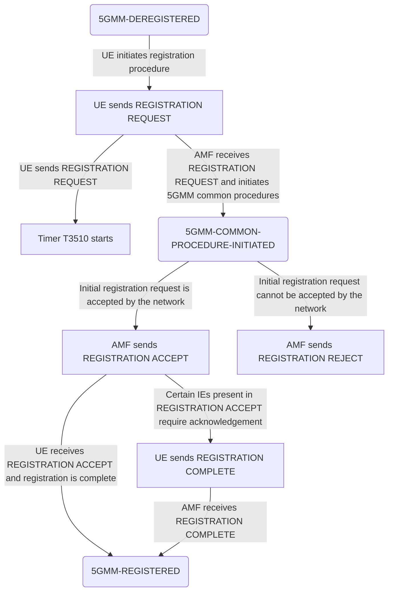

```mermaid
graph TD
    S1("5GMM-DEREGISTERED")
    E1["UE sends REGISTRATION REQUEST"]
    T1["Timer T3510 starts"]
    S2("5GMM-COMMON-PROCEDURE-INITIATED")
    E2["AMF sends REGISTRATION ACCEPT"]
    S3("5GMM-REGISTERED")
    E3["UE sends REGISTRATION COMPLETE"]
    E4["AMF sends REGISTRATION REJECT"]

    S1 -- UE initiates registration procedure --> E1
    E1 -- UE sends REGISTRATION REQUEST --> T1
    E1 -- AMF receives REGISTRATION REQUEST and initiates 5GMM common procedures --> S2
    S2 -- Initial registration request is accepted by the network --> E2
    E2 -- UE receives REGISTRATION ACCEPT and registration is complete --> S3
    E2 -- Certain IEs present in REGISTRATION ACCEPT require acknowledgement --> E3
    E3 -- AMF receives REGISTRATION COMPLETE --> S3
    S2 -- Initial registration request cannot be accepted by the network --> E4
```